# Chapter 6 "다양한 연관관계 매핑"

* 엔티티의 연관관계를 매핑할 때 고려해야 할 3가지
    1. **다중성**  
        a. 다대일 (@ManyToOne)  
        b. 일대다 (@OneToMany)  
        c. 일대일 (@OneToOne)  
        d. 다대다 (@ManyToMany)  
    2. **단방향, 양방향**
        - 테이블은 외래 키 하나로 조인을 사용해서 양방향으로 쿼리가 가능하므로 사실상 방향 개념이 없음.  
          반면, 객체는 참조용 필드를 가지고 있는 객체만 연관된 객체를 조회할 수 있음.
        - 단방향 : 객체 관계에서 한 쪽만 참조하는 것.
        - 양방향 : 양쪽이 서로 참조하는 것.
    3. **연관관계의 주인**
        - 데이터베이스는 외래 키 하나로 두 테이블이 연관관계를 맺음.  
          따라서 테이블의 연관관계를 관리하는 포인트는 외래 키 하나임.
        - 반면, 엔티티를 양방향으로 매핑하면 A->B, B->A 2곳에서 참조함.  
          따라서, 객체의 연관관계를 관리하는 포인트는 2곳임.
        - JPA는 두 객체 연관관계 중 하나를 정해서 데이터베이스 외래 키를 관리하는데,
          이것을 연관관계의 주인이라 함.  
          따라서, A->B 또는 B->A 둘 중 하나를 정해서 외래키를 관리해야 함.  
          외래 키를 가진 테이블과 매핑한 엔티티가 외래 키를 관리하는 것이 효율적이므로 보통 이곳을 연관관계의 주인으로 선택.  
          주인이 아닌 방향은 외래 키를 변경할 수 없고 읽기만 가능.
        - 연관관계의 주인은 mappedBy 속성을 사용하지 않음.  
        a. 다대일 (@ManyToOne)  : 단방향, 양방향  
        b. 일대다 (@OneToMany)  : 단방향, 양방향  
        c. 일대일 (@OneToOne)  : 주 테이블 단방향, 양방향 / 대상 테이블 단방향, 양방향  
        d. 다대다 (@ManyToMany)  : 단방향, 양방향

---


## 6.1. 다대일

* 다대일 관계의 반대 방향은 항상 일대다 관계고, 일대다 관계의 반대 방향은 항상 다대일 관계.
* 데이터베이스 테이블의 1, N 관계에서 외래 키는 항상 N(다) 쪽임. (ex. 회원(N)과 팀(1)이 있으면 회원쪽이 연관관계의 주인)


### 6.1.1 다대일 단방향
  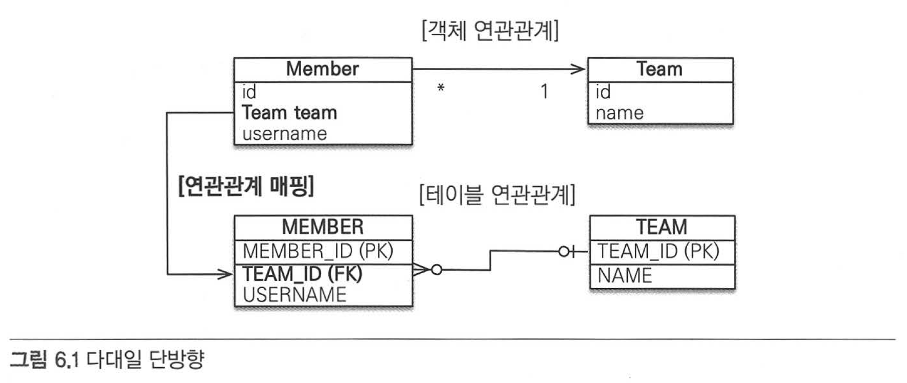

| 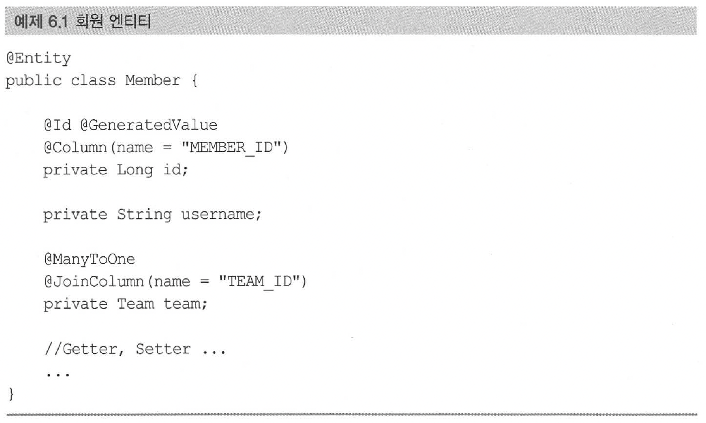 | 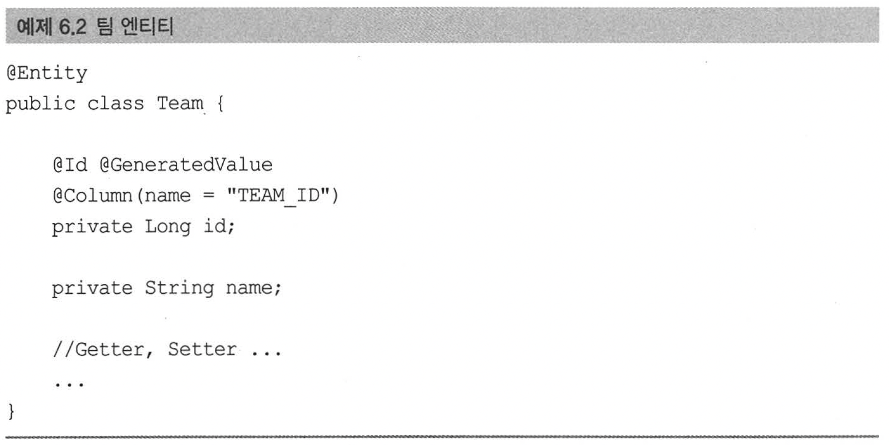 |
|-------------------------------------|-------------------------------------|

- 회원은 Member.team 으로 팀 엔티티를 참조할 수 있지만, 반대로 팀에는 회원을 참조하는 필드가 없음.
  따라서 회원과 팀은 다대일 단방향 연관관계.

```
    @ManyToOne
    @JoinColumn(name = "TEAM_ID")
    private Team team;
```

- @JoinColumn(name = "TEAM_ID") 를 사용해서 Member.team 필드를 TEAM_ID 외래 키와 매핑했음.  
  따라서 Member.team 필드로 회원 테이블의 TEAM_ID 외래 키를 관리.


### 6.1.2 다대일 양방향 [N:1, 1:N]
  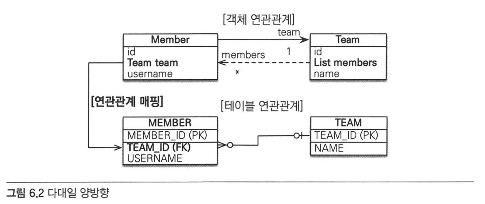

- 다대일 양방향의 객체 연관관계에서 실선이 연관관계의 주인(Member.team) 이고 점선(Team.members)은 연관관계의 주인이 아님.

| 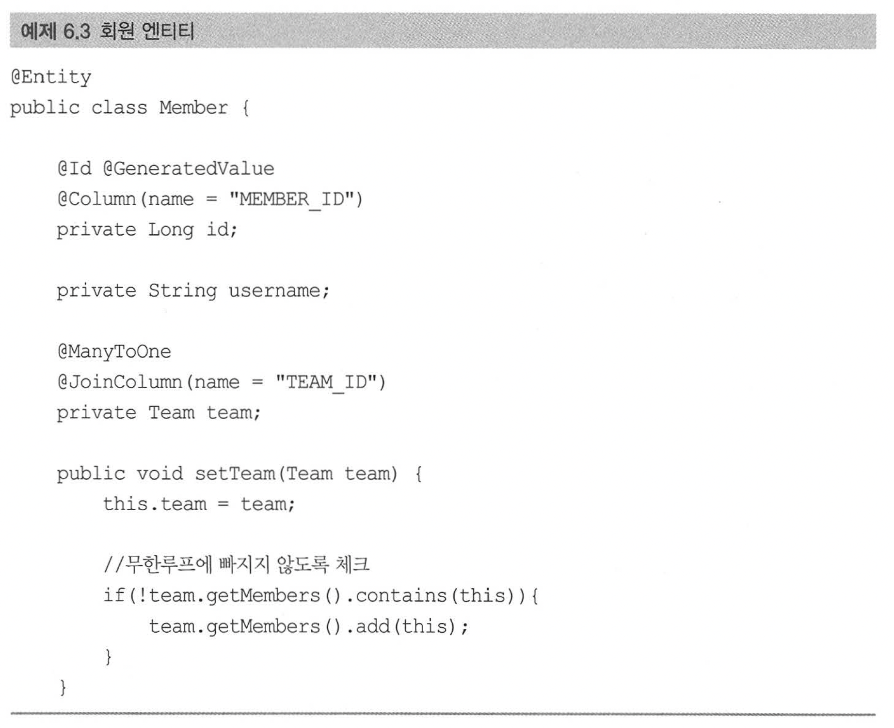 | 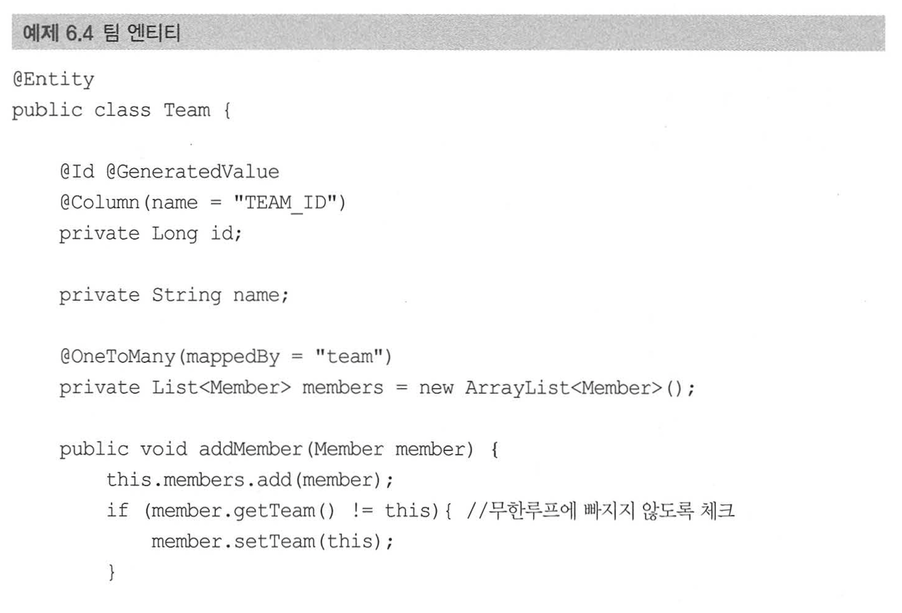 |
|-------------------------------------|-------------------------------------|

- 양방향은 외래 키가 있는 쪽이 연관관계의 주인임  
  일대다와 다대일 연관관계는 항상 다(N) 에 외래 키가 있음. 
  여기서는 다쪽인 MEMBER 테이블이 외래 키를 가지고 있으므로 Member.team이 연관관계의 주인.
- JPA는 외래 키를 관리할 때 연관관계의 주인만 사용 (주인이 아닌 Team.members는 조회를 위한 JPQL이나 객체 그래프를 탐색할 때 사용)
- 양방향 연관관계는 항상 서로를 참조해야 함.  
  어느 한 쪽만 참조하면 양방향 연관관계가 성립하지 않음. 
  항상 서로 참조하게 하려면 연관관계 편의 메소드를 작성하는 것이 좋은데 회원의 setTeam(), 팀의 addMember()메소드가 이런 편의 메소드 예제.
- 편의메소드는 양쪽에 다 작성하면 무한루프에 빠지므로 주의해야 함.

---


## 6.2. 일대다

* 일대다 관계는 엔티티를 하나 이상 참조할 수 있으므로 자바 컬렉션인 collection, List, Set, Map 중에 하나를 사용해야 함.


### 6.2.1 일대다 단방향 [1:N]

- 일대다 : 하나의 팀은 여러 회원을 참조할 수 있음.
- 팀은 회원들은 참조하지만 반대로 회원은 팀을 참조하지 않으면 둘의 관계는 단방향.

  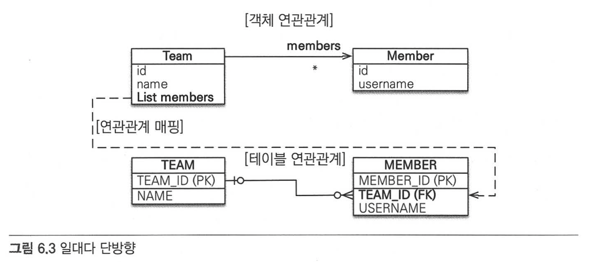

- 팀 엔티티의 Team.members로 회원 테이블의 TEAM_ID 외래 키를 관리.  
  보통 자신이 매핑한 테이블의 외래 키를 관리하는데 , 이 매핑은 반대쪽 테이블에 있는 외래 키를 관리하고 있음을 볼 수 있음.
  일대다 관계에서 외래 키는 항상 다쪽 테이블에 있기 때문.  
- 다 쪽인 Member 엔티티에는 외래 키를 매핑할 수 있는 참조 필드가 없음. 
  대신에 반대쪽인 Team 엔티티에만 참조 필드인 members가 있음. 
  따라서 반대편 테이블의 외래 키를 관리하는 특이한 모습을 볼 수 있음.

| 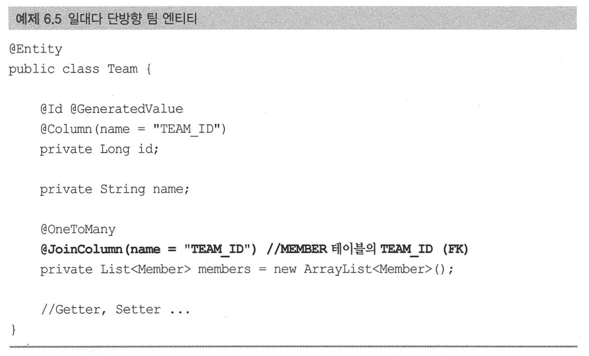 | 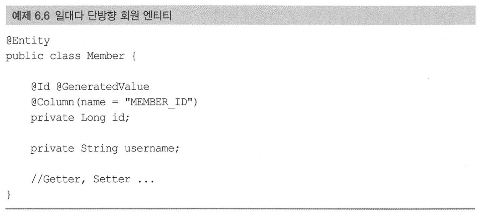 |
|-------------------------------------|-------------------------------------|

- 일대다 단방향 관계를 매핑할 때는 @JoinColumn을 명시해줌.
- 일대다 단방항 매핑의 단점은, 일대다 단방향 매핑의 단점은 매핑한 객체가 관리하는 외래 키가 다른 테이블에 있다는 점.  
  본인 테이블에 외래 키가 있으면 엔티티의 저장과 연관관계 처리를 INSERT SQL 한 번으로 끝낼 수 있지만, 
  다른 테이블에 외래 키가 있으면 연관관계 처리를 위한 UPDATE SQL을 추가로 실행해야 함.
- 결론 - 일대다 단방향 매핑보다는 다대일 앙방항 매핑을 사용하자!


### 6.2.2 일대다 양방향 [1:N, N:1]

- 일대다 양방향 매핑은 존재하지 않음. 다대일 양방향 매핑을 사용해야 함.
- 일대다 양방향과 다대일 양방향은 사실 같은 말이지만, 여기서는 왼쪽을 연관관게의 주인으로 분류하기 때문에 구분지음.
- 관계형 데이터베이스의 특성상 일대다, 다대일 관계는 항상 다 쪽에 외래 키가 있음. 
  따라서 @OneToMany , @ManyToOne 둘 중에 연관관계의 주인은 항상 다 쪽인 @ManyToOne을 사용한 곳. 
  이런 이유로 @ManyToOne 에는 mappedBy 속성이 없음.
- 일대다 단방향 매핑 반대편에 같은 외래 키를 사용하는 다대일 단방향 매핑을 읽기 전용으로 하나 추가하면 일대다 가능.

  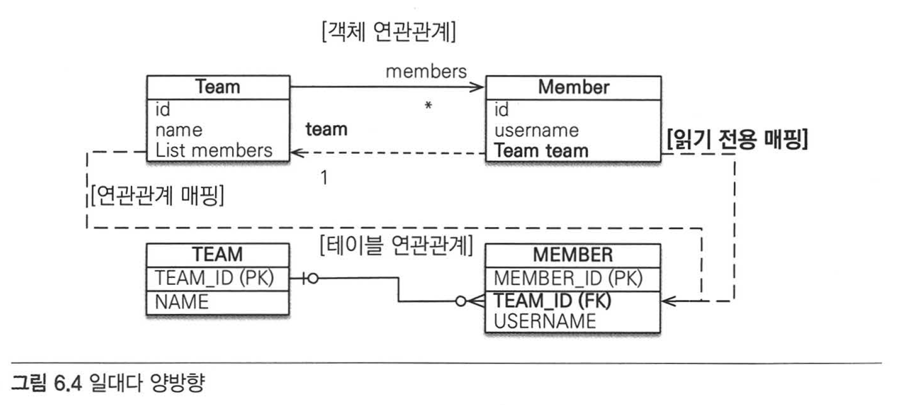

| 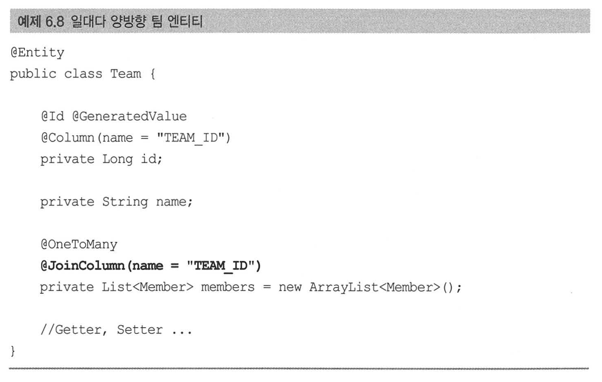 | 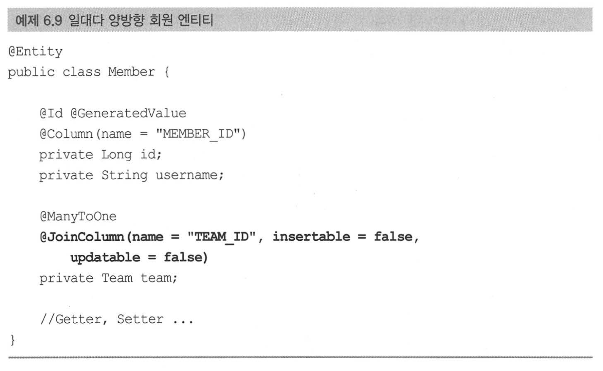 |
|-------------------------------------|-------------------------------------|

- 일대다 단방향 매핑 반대편에 다대일 단방향 매핑을 추가.
- 일대다 단방향 매핑과 같은 TEAM_ID 외래 키 컬럼을 매핑했는데, 이렇게 되면 둘 다 같은 키를 관리하므로 문제가 발생할 수 있음. 
  따라서 반대편인 다대일 쪽은 insertable = false, updatable = false로 설정해서 읽기만 가능하게 함.
- 이 방법은 일대다 양방향 매핑이라기보다는 일대다 단방향 매핑 반대편에 다대일 단방향 매핑을 읽기 전용으로 추가해서 일대다 양방향처럼 보이도록 하는 방법.
  따라서 일대다 단방 매핑이 가지는 단점을 그대로 가짐.

---


## 6.3. 일대일 [1:1]

* 일대일 관계는 양쪽이 서로 하나의 관계만 가짐. (회원은 하나의 사물함만 사용, 사물함도 하나의 회원에게만 사용됨.)
* 일대일 관계의 특징
    - 일대일 관계는 그 반대도 일대일 관계. 
    - 테이블 관계에서 일대다, 다대일은 항상 다(N)쪽이 외래 키를 가짐.
      반면에 일대일 관계는 주 테이블이나 대상 테이블둘중 어느 곳이나외래 키를가질 수 있음.  
      테이블은 주 테이블이든 대상 테이블이든 외래 키 하나만 있으면 양쪽으로 조회 할 수 있음.


### 6.3.1 주 테이블에 외래 키

- 주 객체가 대상 객체를 참조하는 것처럼 주 테이블에 외래 키를 두고 대상 테이블을 참조.
- 외래 키를 객체 참조와 비슷하게 사용할 수 있어서 객체지향 개발자들이 선호.
- 주 테이블이 외래 키를 가지고 있으므로 주 테이블만 확인해도 대상 테이블과 연관관계가 있는지 알 수 있음.

#### 단방향
  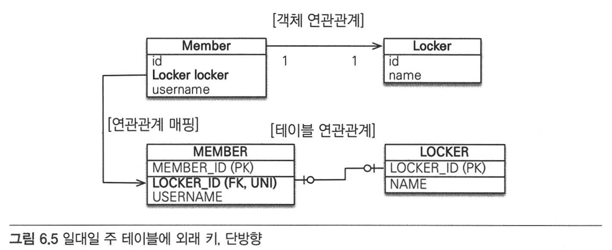
  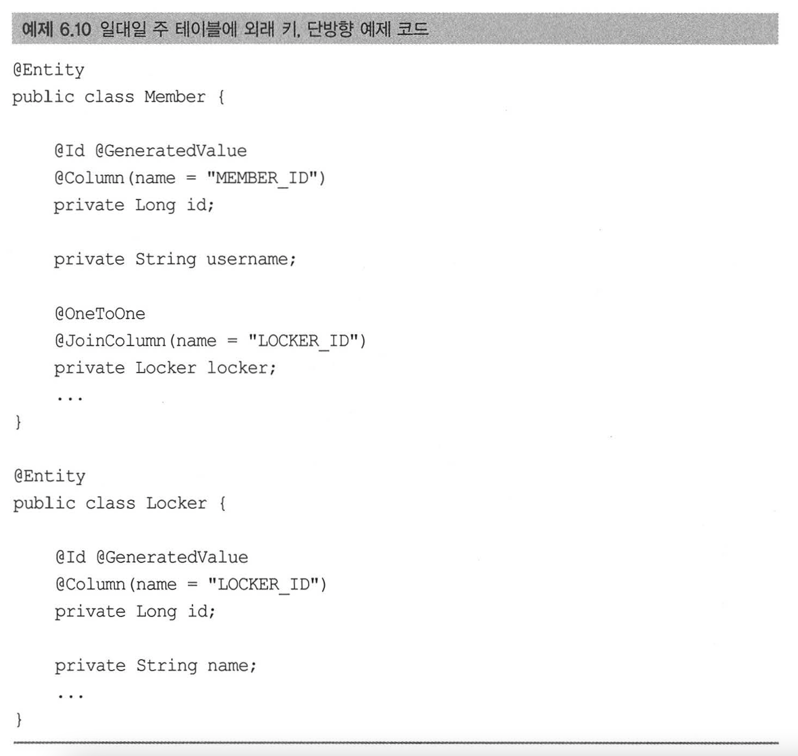
- MEMBER가 주 테이블이고 LOCKER는 대상 테이블.
- 일대일 관계이므로 객체 매핑에 @OneToOne을 사용했고 데이터베이스에는 LOCKER_ID 외래 키에 유니크 제약 조건 (UNI)을 추가. 
  이 관계는 다대일 단방향(@ManyToOne)과 거의 비슷.

#### 양방향
  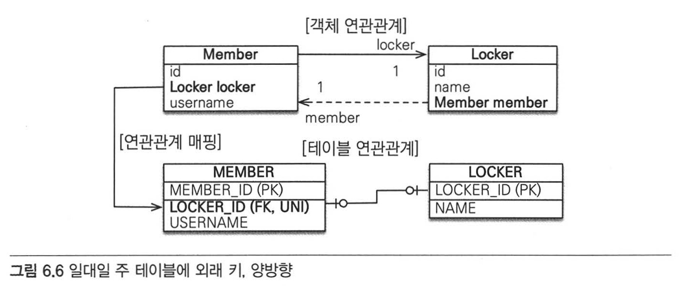
  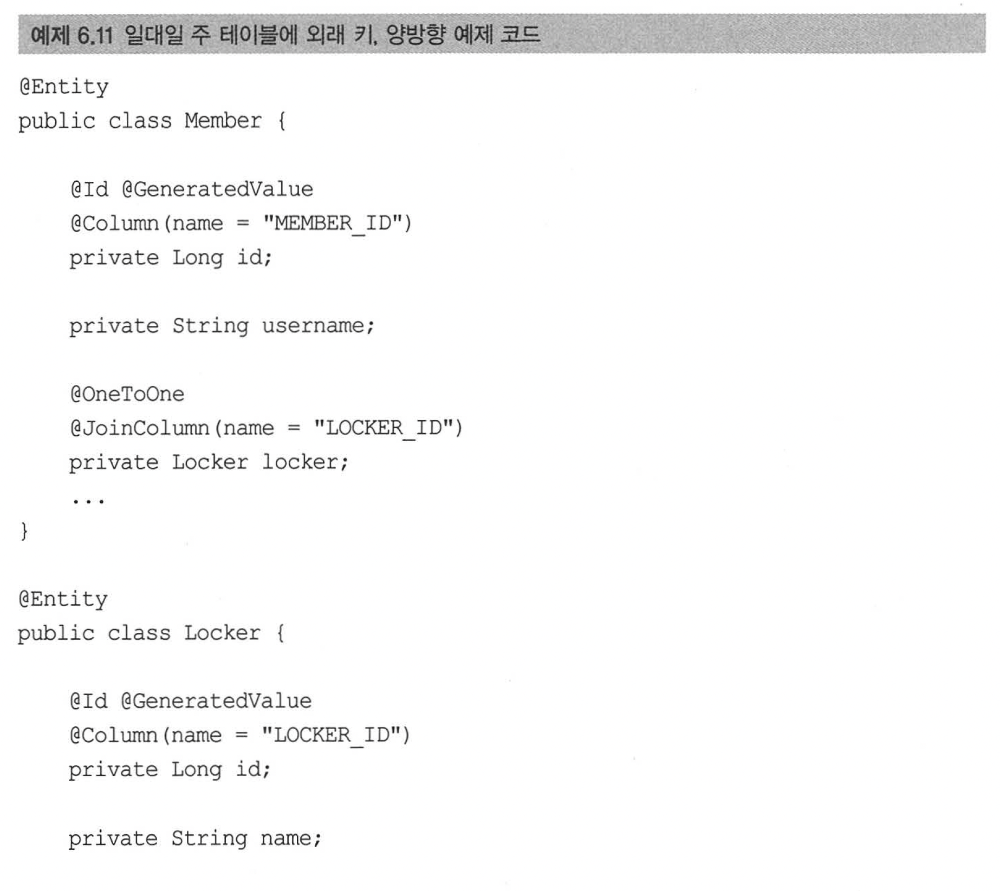
  .png)
- 양방향이므로 연관관계의 주인을 정해야 함. MEMBER 테이블이 외래 키를 가지고 있으므로 Member 엔티티에 있는 Member.locker가 연관관계의 주인.  
  따라서 반대 매핑인 사물함의 Locker.member는 mappedBy를 선언해서 연관관계의 주인이 아니라고 설정.


### 6.3.2 대상 테이블에 외래 키

- 전통적인 데이터베이스 개발자들은 보통 대상 테이블에 외래 키를 두는 것을 선호.
- 테이블 관계를 일대일에서 일대다로 변경할 때 테이블 구조를 그대로 유지할 수 있음.

#### 단방향
  
- 일대일 관계 중 대상 테이블에 외래 키가 있는 단방향 관계는 JPA에서 지원하지 않음. 이런 모양으로 매핑할 수 있는 방법도 없음.
- 이 때는 단방향 관계를 Locker에서 Member 방향으로 수정하거나, 양방향 관계로 만들고 Locker를 연관관계의 주인으로 설정해야 함.

#### 양방향
  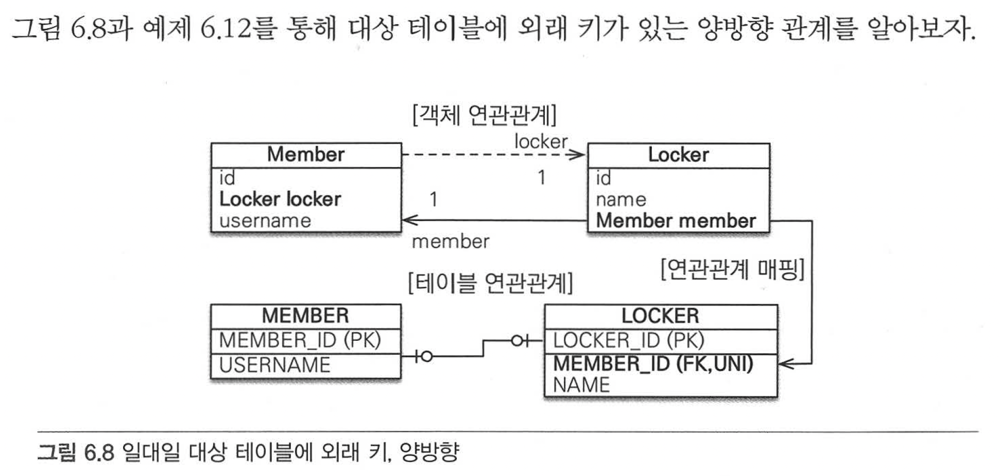
  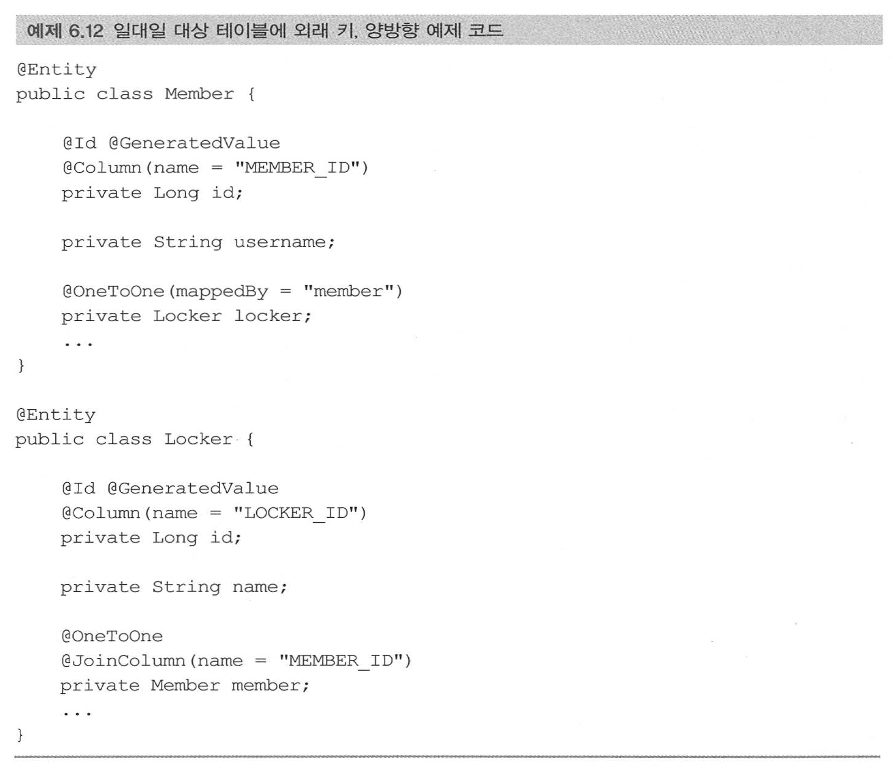
- 일대일 매핑에서 대상 테이블에 외래 키를 두고 싶으면 이렇게 양방향으로 매핑.
- 주 엔티티인 Member 엔티티 대신에 대상 엔티티인 Locker를 연관관계의 주인으로 만들어서 Locker 테이블의 외래 키를 관리하도록 함.

---


## 6.4. 다대다 [N:N]

* 관계형 데이터베이스는 정규화된 테이블 2개로 다대다 관계를 표현할 수 없음. 
  그래서 보통 다대다 관계를 일대다, 다대일 관계로 풀어내는 연결 테이블을 사용함.
  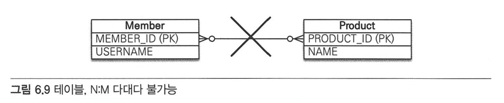
* 예를 들어 회원들은 상품을 주문하고, 반대로 상품들은 회원 들에 의해 주문되므로 둘은 다대다 관계임. 
  따라서 회원테이블과 상품 테이블만으로는 이 관계를 표현할 수 없음.

  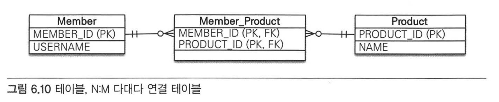
* 위처럼 중간에 연결 테이블을 넣어줘야 함.
  연결 테이블을 이용하여 다대다 관계를 일대다, 다대 관계로 풀어낼 수 있음.

* 객체는 테이블과는 다르게 객체 2개로 다대다 관계를 만들 수 있음.  
  예를 들어 회원 객체는 컬렉션을 사용해서 상품들을 참조하면 되고,
  반대로 상품들도 컬 렉션을 사용해서 회원들을 참조하면 됨.
  @ManyToMany를 사용하면 아래와 같이 다대다 관계를 편리하게 매핑할 수 있음.
  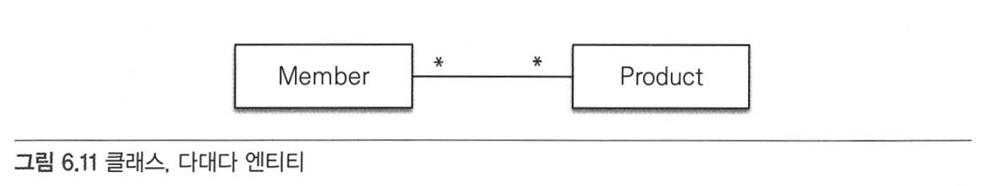


### 6.4.1 다대다: 단방향
  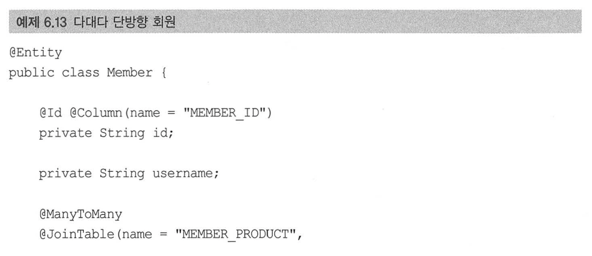
  .png)
  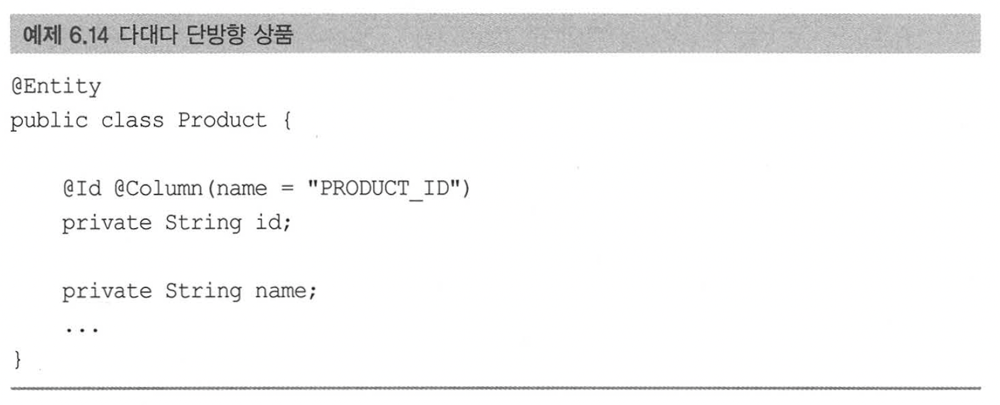

- 회원 엔티티와 상품 엔티티를 @ManyToMany로 매핑했음. 
  여기서 중요한 점은 @ManyToMany와 @JoinTable을 사용해서 연결 테이블을 바로 매핑 한 것. 
  따라서 회원과 상품을 연결하는 회원-상품(Member_Product) 엔티티 없이 매핑 을 완료할 수 있음.

- @JoinTable의 속성  
  a. @JoinTable.name: 연결 테이블을 지정함. (여기서는 MEMBER_PRODUCT 테이블을 선택함)  
  b. @JoinTable.joinColumns : 현재 방향인 회원과 매핑할 조인 컬럼 정보를 지정함. (여기서는 MEMBER_ID로 지정함)  
  c. @JoinTable.inverseJoinColumns : 반대 방향인 상품과 매 핑할 조인 컬럼 정보를 지정함. (여기서는 PRODUCT_ID로 지정함)

- MEMBER_PRODUCT 테이블은 다대다 관계를 일대다, 다대일 관계로 풀어내기 위해 필요한 연결 테이블일 뿐임. 
  @ManyToMany로 매핑한 덕분에 다대다 관계를 사용할 때는 이 연결 테이블을 신경 쓰지 않아도 됨.
  
  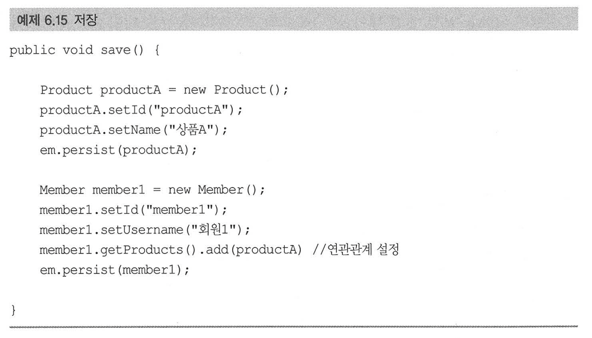
  - 회원1과 상품A의 연관관계를 설정했으므로 회원1을 저장할 때 연결 테이블에도 값이 저장됨.
  - 따라서 이 코드를 실행하면 다음과 같은 SQL이 실행됨.
    ```sql
    INSERT INTO PRODUCT ... ;
    INSERT INTO MEMBER ... ;
    INSERT INTO MEMBER_PRODUCT ... ;
    ```
    
  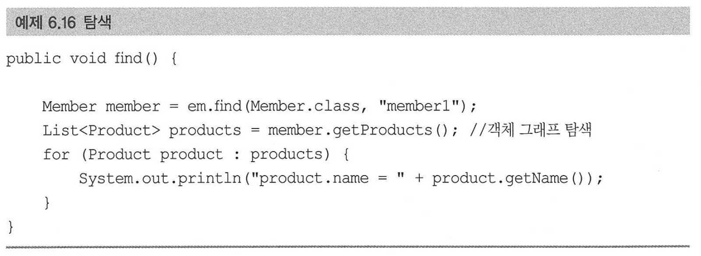
  - 순서대로 저장한 후에 탐색해보면 저장해두었던 상품1이 조회됨.  
    member.getProducts() 를 호출해서 상품 이름을 출력하면 다음 SQL이 실행됨.
    ```sql
    SELECT * FROM MEMBER_PRODUCT MP
    INNER JOIN PRODUCT P ON MP.PRODUCT ID=P.PRODUCT_ID
    WHERE MP.MEMBER ID = ?
    ```
  - 실행된 SQL을 보면 연결 테이블인 MEMBER_PRODUCT와 상품 테이블을 조인해서 연관된 상품을 조회함.  
    @ManyToMany 덕분에 복잡한 다대다 관계를 애플리케이션에서는 아주 단순하게 사용할 수 있음.


### 6.4.2 다대다: 양방향
  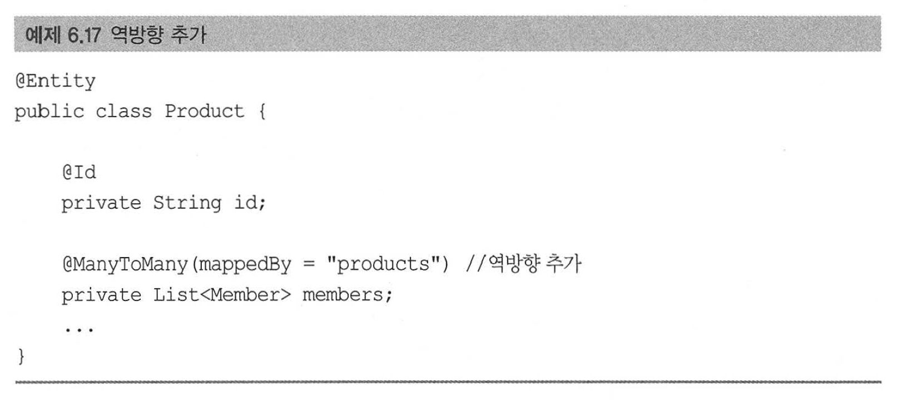
- 다대다 매핑 이므로 역방향도 @ManyToMany를 사용함.
  그리고 양쪽 중 원하는 곳에 mappedBy로 연관관계의 주인을 지정함. (물론 mappedBy가 없는 곳이 연관관계의 주인)
- 다대다의 양방향 연관관계는 다음처럼 설정하면 됨.
    ```
    member.getProducts().add(product);
    product.getMembers().add(member);
    ```
- 양방향 연관관계는 연관관계 편의 메소드를 추가해서 관리하는 것이 편리함.  
  다음처럼 회원 엔티티에 연관관계 편의메소드를 추가하면 됨.
    ```
    public void addProduct(Product product) {
        ....
        products.add(product);
        product.getMembers().add(this);
    }
    ```
- 연관관계 편의 메소드를 추가했으므로 다음처럼 간단히 양방향 연관관계를 설정하면 됨.
    ```
    member.addProduct(product);
    ```
- 양방향 연관관계로 만들었으므로 아래와 같이 product.getMembers()를 사용해서 역방향으로 객체 그래프를 탐색할 수 있음.
  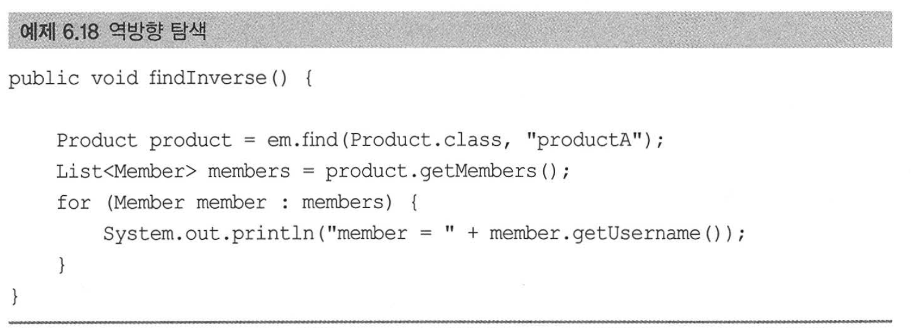


### 6.4.3 다대다: 매핑의 한계와 극복, 연결 엔티티 사용

- @ManyToMany를 사용하면 연결 테이블을 자동으로 처리해주므로 도메인 모델이 단순해지고 여러 가지로 편리하지만, 실무에서 사용하기엔 무리가 있는 경우가 많음.
  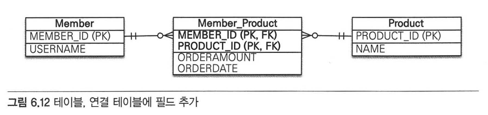
- 회원이 상품을 주문하면 보통은 연결 테이블에 추가로 주문 수량 컬럼이나 주문한 날짜 같은 컬럼이 더 필요해짐.
- 연결 테이블에 주문 수량(ORDERAMOUNT)과 주문 날짜(ORDERDATE)컬럼을 추가하면 더는 @ManyToMany를 사용할 수 없음.
  (주문 엔티티나 상품 엔티티에는 추가한 컬럼들을 매핑할 수 없기 때문)
  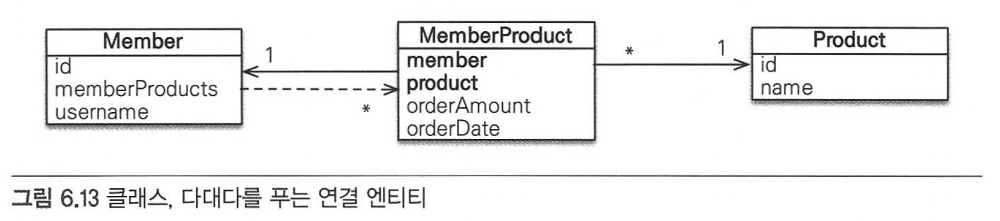
- 결국 위 그림처럼 연결 테이블을 매핑하는 연결 엔티티를 만들고 이곳에 추가한 컬럼들을 매핑해야 함.
- 엔티티 간의 관계도 테이블 관계처럼 다대다에서 일대다, 다대일 관계로 풀어야 함. 여기서는 회원상품(Member Product) 엔티티 추가.  
  <br>
  
  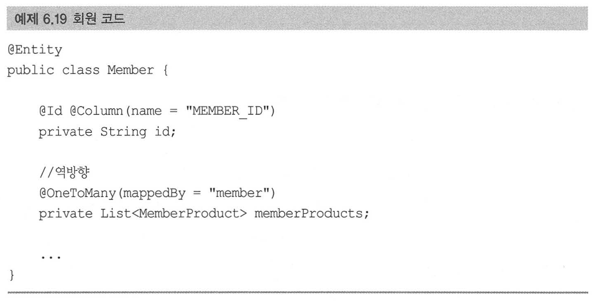
- 회원과 회원상품을 양방향 관계로 만들었음. 회원상품 엔티티 쪽이 외래 키를 가지고 있으므로 연관관계의 주인. 따라서 연관관계의 주인이 아닌 회원의 Member.memberProducts에는 mappedBy를 사용.   
  <br>
  
  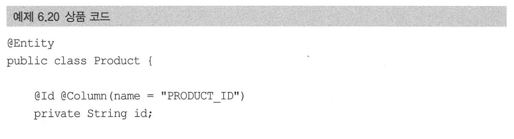
  .png)
- 상품 엔티티에서 회원상품 엔티티로 객체 그래프 탐색 기능이 필요하지 않다고 판단해서 연관관계를 만들지 않음.  
  <br>
  
  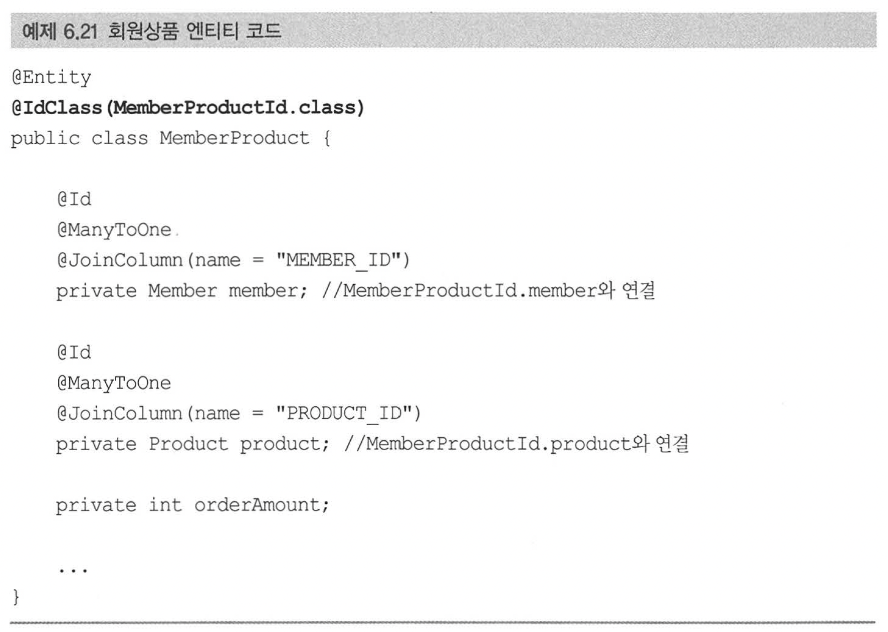
- 회원상품(Member Product) 엔티티를 보면 기본 키를 매핑하는 @Id와 외래 키를 매핑하는 @JoinColumn을 동시에 사용해서 기본 키 + 외래 키를 한번에 매핑. 그리고 @IdClass를 사용해서 복합 기본 키를 매핑.
  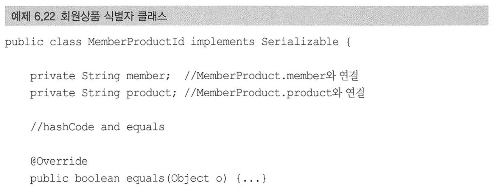
  .png)

#### 복합기본키
- 회원상품 엔티티는 기본 키가 MEMBER ID와 PRODUCT_ID로 이루어진 복합기본키(복합키).
- JPA에서 복합 키를 사용하려면 별도의 식별자 클래스를 만들어야 하고, 엔티티에 @IdClass를 사용해서 식별자 클래스를 지정.
- 복합키를 위한 식별자 클래스의 특징
  - 복합키는 별도의 식별자 클래스로 만들어야함.
  - Serializable을 구현해야 함.
  - equals와 hashCode 메소드를 구현해야 함. 
  - 기본 생성자가 있어야 함.
  - 식별자클래스는 public 이어야 함. 
  - @IdClass를 사용하는 방법 외에 @EmbeddedId 도 가용 가능

#### 식별 관계
- 위 회원상품은 회원과 상품의 기본 키를 받아서 자신의 기본 키로 사용하는 것처럼,  
  부모 테이블의 기본 키를 받아서 자신의 기본 키 + 외래 키로 사용하는 것을 식별 관계(Identifying Relationship)라 함.
- 회원상품(Member Product)은 
  - 회원의 기본 키를 받아서 자신의 기본 키로 사용함과 동시에 회원과의 관계를 위한 외래 키로 사용.
  - 상품의 기본 키도 받아서 자신의 기본 키로 사용함과 동시에 상품과의 관계를 위한 외래 키로 사용.
  - MemberProductId 식별자 클래스로 두 기본 키를 묶어서 복합기본키로 사용.

  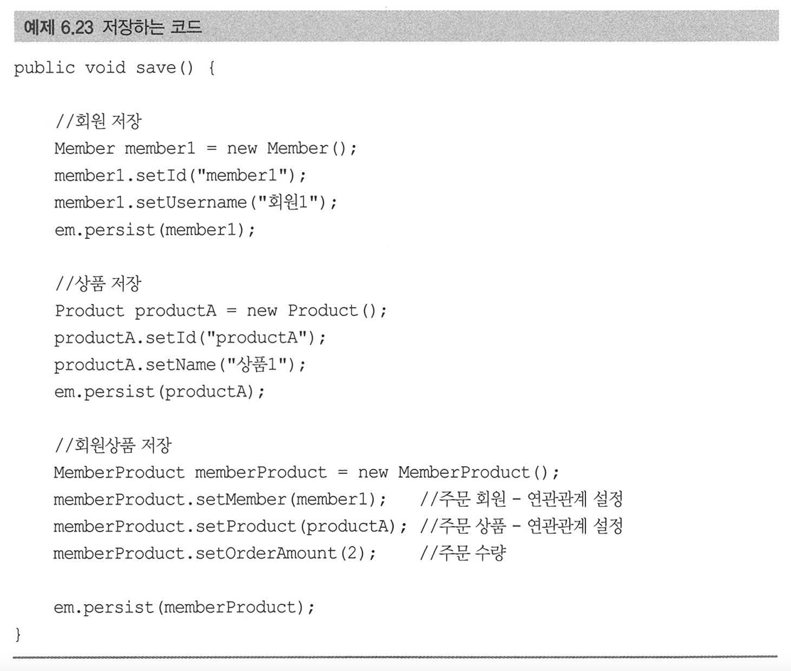
- 회원상품 엔티티를 만들면서 연관된 회원 엔티티와 상품 엔티티를 설정.
- 회원상품 엔티티는 데이터베이스에 저장될 때 연관된 회원의 식별자와 상품의 식별자를 가져와서 자신의 기본 키 값으로 사용.  
  <br>
  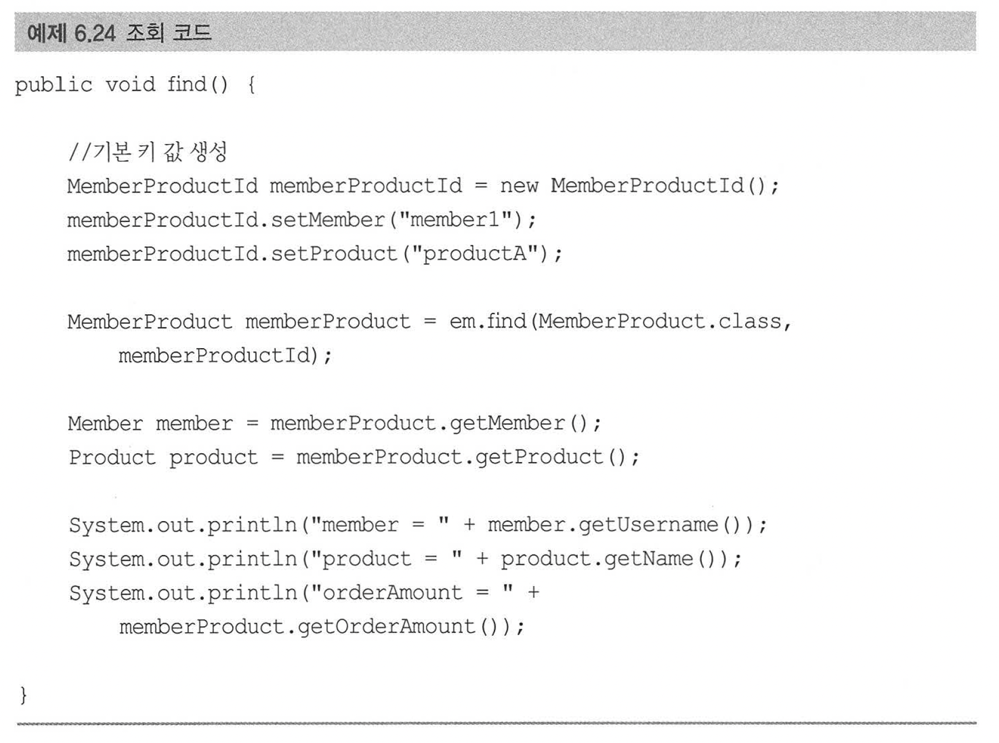
- 복합 키는 항상 식별자 클래스를 만들어야 함.
- 복합 키를 사용하는 방법은 복잡함. 
  단순히 컬럼 하나만 기본 키로 사용하는 것과 비교해서 복합 키를 사용하면 ORM 매핑에서 처리할 일이 상당히 많아짐.
  복합 키를 위한 식별자 클래스도 만들어야 하고 @IdClass 또는 @EmbeddedId도 사용해야 함. 
  그리고 식별자 클래스에 equals, hashCode도 구현해야 함.
- 위와 같은 복잡한 상황을 피하기 위해 아래에서 간단히 다대다 관계를 구성하는 방법을 아래에서 설명.


### 6.4.4 다대다: 새로운 기본 키 사용

- 데이터베이스에서 자동으로 생성해주는 대리 키를 Long 값으로 사용하는 것을 추천함.
  - 간편하고 거의 영구히 쓸 수 있으며 비즈니스에 의존하지 않음. 
  - ORM 매핑 시에 복합 키를 만들지 않아도 되므로 간단히 매핑을 완성할 수 있음.  
  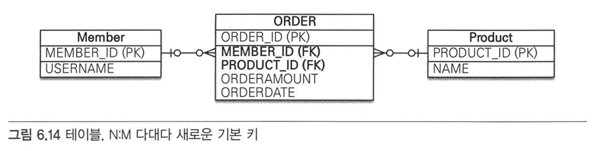
- ORDER_ID라는 새로운 기본 키를 하나 만들고 MEMBER_ID, PRODUCT_ID 컬럼은 외래 키로만 사용함.  
  <br>

  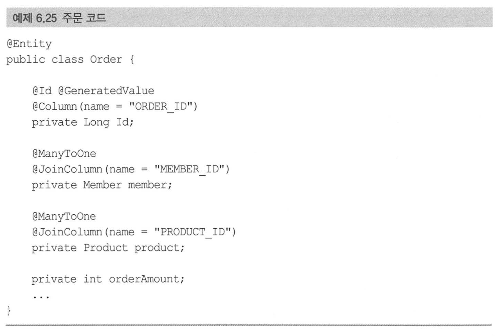
- 대리 키를 사용함으로써 이전에 보았던 식별 관계에 복합 키를 사용하는 것보다 매핑이 단순하고 이해하기 쉬워짐.  
  아래 예제 6.26 회원 엔티티와 상품 엔티티는 변경사항이 없음.
  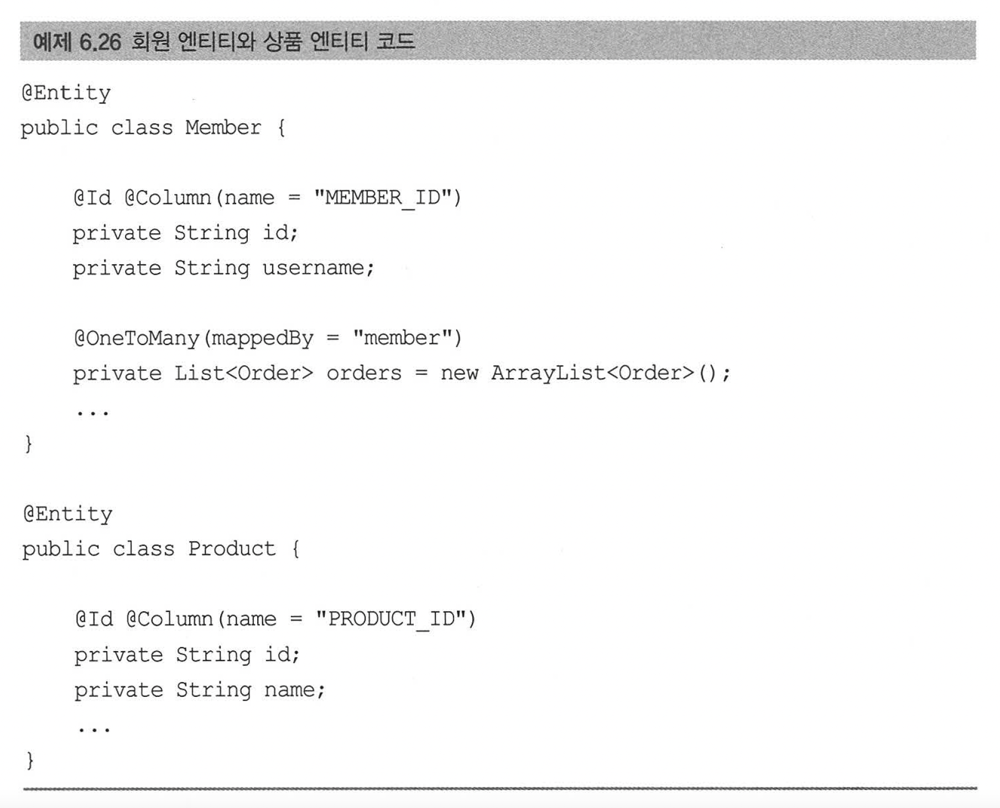
  <br>

  
  .png)
  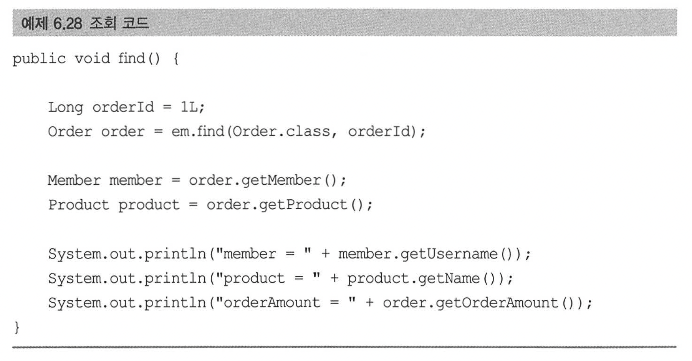
- 위 코드들은 저장 및 조회 코드인데, 식별자 클래스를 사용하지 않아서 코드가 한결 단순해졌음.  
  이처럼 새로운 기본 키를 사용해서 다대다 관계를 풀어내는 것도 좋은 방법임.


### 6.4.5 다대다 연관관계 정리
- 다대다 관계를 일대다 다대일 관계로 풀어내기 위해 연결 테이블을 만들 때 식별자를 어떻게 구성할지 선택해야 함.
  - 식별관계 : 받아온 식별자를 기본 키 + 외래 키로 사용.
  - 비식별관계 : 받아온 식별자는 외래 키로만 사용하고 새로운 식별자를 추가.
- 객체 입장에서 보면 2번처럼 비식별 관계를 사용하는 것이 복합 키를 위한 식별자 클래스를 만들지 않아도 되므로 단순하고 편리하게 ORM 매핑을 할 수 있음.

