# Chapter 9 "값 타입"

* JPA의 데이터 타입을 가장 크게 분류하면 다음 2가지로 나눌 수 있음.  
    1. **엔티티 타입**   
       - @Entity로 정의하는 객체  
       - 식별자를 통해 지속해서 추적할 수 있음  
    2. **값 타입**  
       - int, Integer, String 처럼 단순히 값으로 사용하는 자바 기본 타입이나 객체  
       - 식별자가 없고 숫자나 문자같은 속성만 있으므로 추적할 수 없음  
       - 값 타입은 다음 3가지로 나눌 수 있음.  
           a. 기본값 타입 basic value type  
               - 자바 기본 타입 (예: int, double)   
               - 래퍼 클래스 (예: Integer)  
               - String  
           b. 임베디드 타입 embeded type (복합 값 타입)  
               - JPA에서 사용자가 직접 정의한 값 타입      
           c. 컬렉션 값 타입 collection value type  
               - 하나 이상의 값 타입을 저장할 때 사용.
       
 
---


## 9.1. 기본값 타입


```java
// 예제 9.1
@Entity
public class Member {
    
    @Id @GenerateValue
    private Long id;
  
    private String name;
    private int age;
    //...
}
```

- Member에서 String, int 가 값 타입임.
- Member Entity는 id라는 식별자 값도 가지고, 생명주기도 있지만 값 타입인 name, age 속성은 식별자 값도 없고 생명주기도 회원엔티티에 의존함.
- 회원 엔티티 인스턴스를 제거하면 name, age 값도 제거됨.
- 값 타입은 공유하면 안됨. (회원 엔티티 이름을 변경한다고 해서 나의 이름까지 변경되면 안됨.)

- 참고) 자바에서 int, double 같은 기본 값(primitive type)은 절대 공유되지 않음.  예를 들어, a=b 코드는 b의 값을 복사해서 a에 입력하는 것임.


## 9.2. 임베디드 타입(복합 값 타입)

- JPA에서 새로운 값 타입을 직접 정의해서 사용하는 것.

```java
// 예제 9.2
@Entity
public class Member {
    
    @Id @GenerateValue
    private Long id;
    private String name;
    
    // 근무기간
    @Temporal (TemporalType.DATE) java.util.Date startDate;
    @Temporal (TemporalType.DATE) java.util.Date endDate;
  
    // 집 주소 표현
    private String city;
    private String street;
    private String zipcode;
    //...
}
```

- 회원 엔티티는 이름, 근무 시작일, 근무 종료일, 주소 도시, 주소 번지, 주소 우편번호를 가진다
- 위와 같이 설명하는 것보다는, 회원 엔티티는 이름, 근무 기간, 집주소를 가진다고 설명하는 것이 명확해 보임.

```java
// 예제 9.3
@Entity
public class Member {
    
    @Id @GenerateValue
    private Long id;
    private String name;
    
    @Embeded Period workPeriod;    // 근무기간
    @Embeded Address homeAddress;  // 집 주소
    //...
}
```

```java
// 예제 9.4
@Embeddable
public class Period {
    
    @Temporal (TemporalType.DATE) java.util.Date startDate;
    @Temporal (TemporalType.DATE) java.util.Date endDate;
    //..
    
    public boolean isWork(Date date) {
        //.. 값 타입을 위한 메서드를 정의할 수 있다.
    }
}
```

```java
// 예제 9.5
@Embeddable
public class Address {
    
    @Column(name="city") //매핑할 컬럼 정의 가능
    private String city;
    private String street;
    private String zipcode;
    //..
}
```

- 새로 정의한 값 타입들은 재사용할 수 있고 응집도도 높음.
- 예제 9.4의 Period.isWork() 처럼 해당 값 타입만 사용하는 의미있는 메서드도 만들 수 있움.
- @Embeddable : 값 타입을 정의하는 곳에 표시
- @Embedded : 값 타입을 사용하는 곳에 표시   

- 임베디드 타입은 기본 생성자가 필수.


### 9.2.1 임베디드 타입과 테이블 매핑

  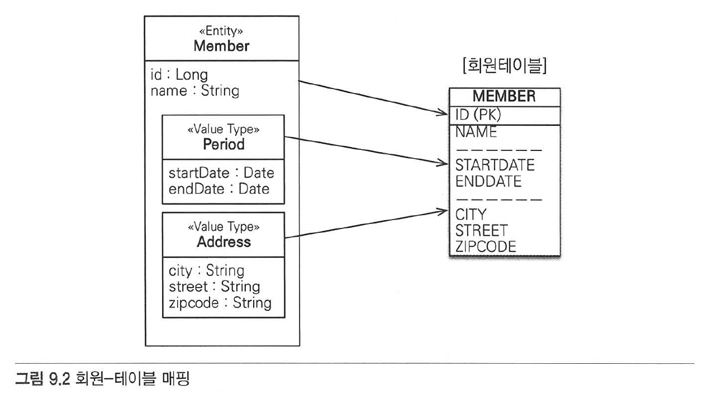

- 임베디드 타입은 엔티티의 값일 뿐임. 따라서 값이 속한 엔티티의 테이블에 매핑.
- 임베디드 타입 덕분에 객체와 테이블을 아주 세밀하게 매핑하는 것이 가능.
- 잘 설계한 ORM 애플리케이션은 매핑한 테이블의 수보다 클래스의 수가 많음.
- ORM을 사용하지 않고 개발하면 테이블 컬럼과 객체 필드를 대부분 1:1로 매핑하고,  
  주소나 근무 기간 같은 값 타입 클래스를 만들어서 더 객체지향적으로 개발하고 싶어도 어려워짐.


### 9.2.2 임베디드 타입과 연관관계

- 임베디드 타입은 값 타입을 포함하거나 엔티티를 참조할 수 있음.

  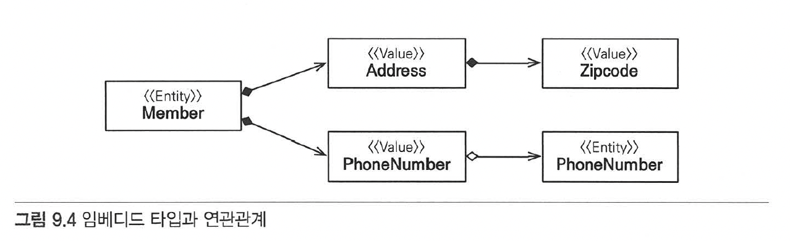

  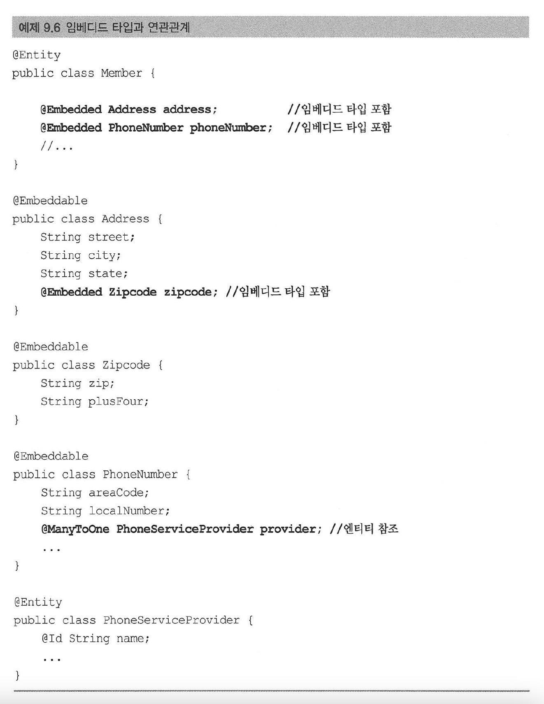
- 값 타입인 Address가 값 타입인 zipcode를 포함하고,  
  값 타입인 PhoneNumber가 엔티티 타입인 PhoneServiceProvider를 참조한다.


### 9.2.3 @AttributeOverride: 속성 재정의

- 임베디드 타입에 정의한 매핑정보를 재정의하려면 엔티티에 @AttributeOverride 를 사용.
- 회원에게 주소가 하나 더 필요하면?

  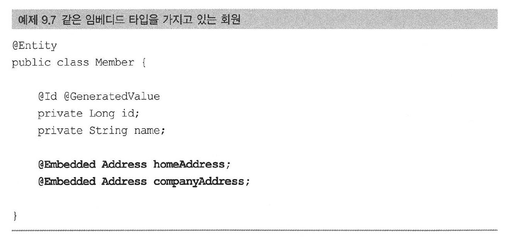

- 집 주소에 회사 주소를 하나 더 추가함. 문제는 테이블에 매핑하는 컬럼명이 중복되는 것.
- 이럴 때는 @AttributeOverride 를 사용해서 매핑정보를 재정의 해야 함.

  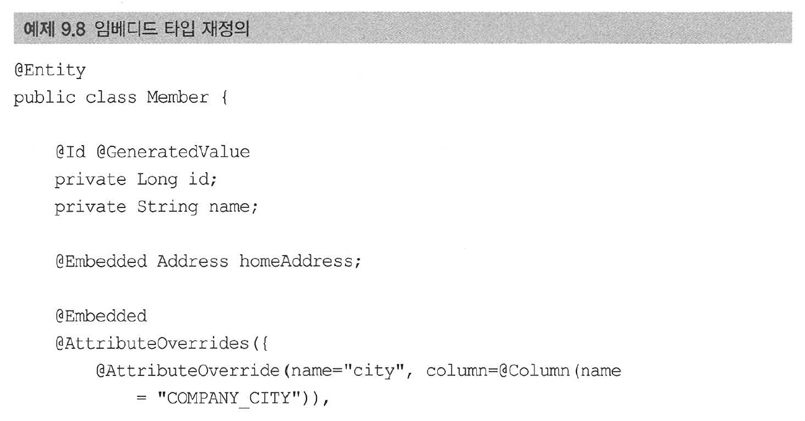
  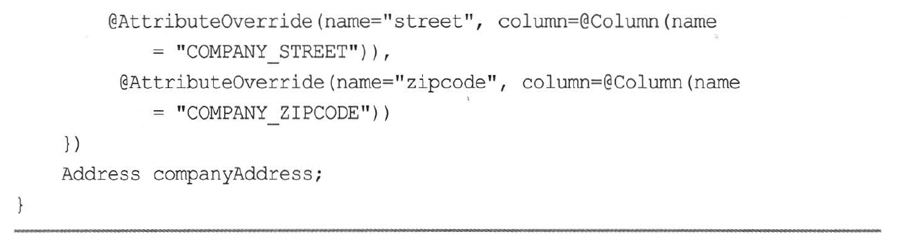

- 생성된 테이블을 보면 재정의한대로 변경되어 있음.
  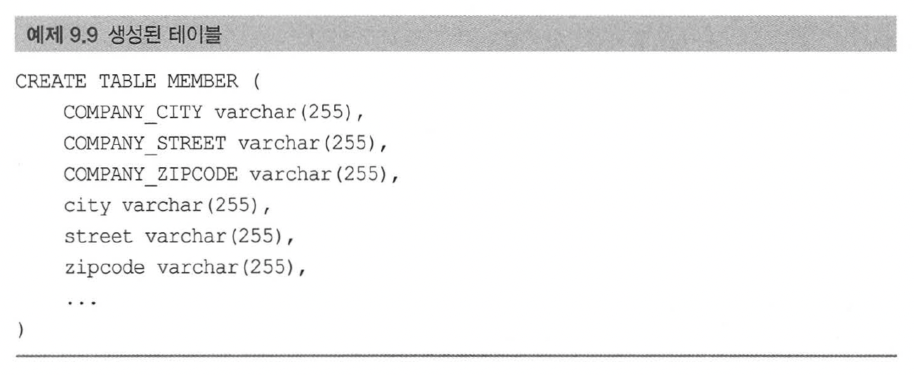


### 9.2.4 임베디드 타입과 null

- 임베디드 타입이 null이면 매핑한 컬럼 값은 모두 null이 됨

```
member.setAddress(null); // null 입력
em.persist(member);
```
- 회원 테이블의 주소와 관련된 CITY, STREET, ZIPCODE 컬럼값은 모두 null 이 됨.


## 9.3. 값 타입과 불변 객체

- 값 타입은 복잡한 객체 세상을 조금이라도 단순화하려고 만든 개념.
- 값 타입은 단순하고 안전하게 다룰 수 있어야 함.


### 9.3.1 값 타입 공유 참조

- 임베디드 타입 같은 값 타입을 여러 엔티티에서 공유하면 위험함.
  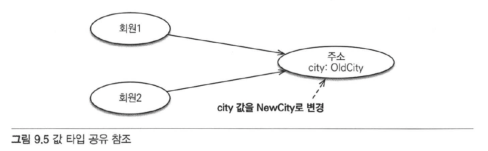
- 그림 9.5의 상황을 코드로 나타내면,

```
member1.setHomeAddress(new Address("OldCity"));
Address address = member1.getHomeAddress();

address.setCity("NewCity"); //회원1의 address 값을 공유해서 사용
member2.setHomeAddress(address);
```

- 회원2에 새로운 주소를 할당하려고 회원1의 주소를 그대로 참조해서 사용.
- 이 코드를 실행하면 회원2의 주소만 "NewCity"로 변경되는 것이 아니라, 회원1의 주소도 변경됨.
- 회원1과 회원2가 같은 address 인스턴스를 참조하기 때문.
- 영속성 컨텍스트는 회원1과 회원2 둘 다 city 속성이 변경된 것으로 판단해서 회원1, 회원2 각각 UPDATE SQL을 실행.
- 이러한 공유 참조로 발생하는 버그는 정말 찾아내기 어려움.


### 9.3.2 값 타입 복사

- 값 타입의 실제 인스턴스 값을 공유하는 것은 위험하므로, 대신에 값(인스턴스을 복사해서 사용해야 함.)  
  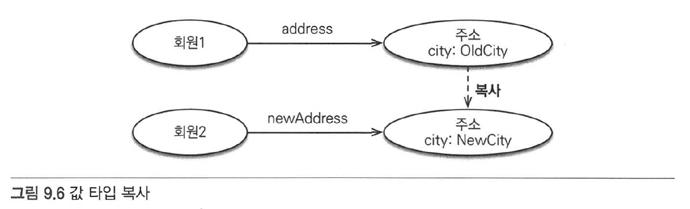
- 그림 9.6의 상황을 코드로 나타내면,
```
member1.setHomeAddress(new Address("OldCity"));
Address address = member1.getHomeAddress();

// 회원1의 address값을 복사해서 새로운 newAddress 값을 생성
Address newAddress = address.clone();

newAddress.setCity("NewCity");
member2.setHomeAddress(newAddress);
```

- 회원2에 새로운 주소를 할당하기 위해 clone() 메서드를 만들었는데, 이 메서드는 자신을 복사해서 반환하도록 구현함.
- 이처럼 값을 복사해서 사용하면 공유 참조로 인해 발생하는 부작용을 피할 수 있음.
- 문제는 임베디드 타입처럼 직접 정의한 값 타입은 **자바의 기본 타입이 아니라 객체 타입**이라는 것.

- 자바는 기본 타입에 값을 대입하면 값을 복사해서 전달함.
```
int a = 10;
int b = a; //기본 타입은 항상 값을 복사한다.
b = 4;
```
- 이 코드의 최종 결과는 a=10, b=4 임. a와 b는 완전히 독립된 값을 가지고 부작용도 없음.
- 문제는 Address 같은 객체 타입임. 자바는 객체에 값을 대입하면 항상 참조값을 전달함
```
Address a = new Address("Old");
Address b = a; //객체 타입은 항상 참조 값을 전달함.
b.setCity("New"); 
```
- Address b=a 에서 a가 참조하는 인스턴스의 참조값을 b에 넘겨줌.
- 따라서 a와 b는 같은 인스턴스를 공유 참조하며, b를 변경하면 a도 변경되는 현상 발생.
- 객체의 공유 참조는 피할 수 없음.
- 가장 단순한 해결방법은 객체의 값을 쉊ㅇ하지 못하게 막는 것. (Address 객체의 setCity() 같은 수정자 메서드를 모두 제거)


### 9.3.3 불변 객체

- 값 타입은 부작용 걱정 없이 사용할 수 있어야 함.
- 객체를 불변하게 만들면 값을 수정할 수 없으므로 부작용을 원천 차단할 수 있음.
- 값 타입은 될 수 있으면 불변 객체로 설계해야 함.

  

- 불변이라는 작은 제약으로 부작용이라는 큰 재앙을 막을 수 있음.


## 9.4. 값 타입의 비교

```
int a = 10;
int b = 10;

Address a = new Address("서울시","종로구","1번지");
Address b = new Address("서울시","종로구","1번지");
```

- int a 의 숫자 10과 int b의 숫자 10은 같다고 표현한다.
- Address a 와 Address b는 같다고 표현한다.

- 동일성(identity)비교 : 인스턴스의 참조값을 비교, == 사용.
- 동등성(equivalence)비교 : 인스턴스의 값을 비교, equals() 사용.
- a == b 는 거짓이며, a.equals(b)를 사용해서 동등성 비교를 해야 함.


## 9.5. 값 타입 컬렉션

- 값 타입을 하나 이상 저장하려면 컬렉션에 보관하고 @ElementCollection, @CollectionTable 어노테이션을 사용.

  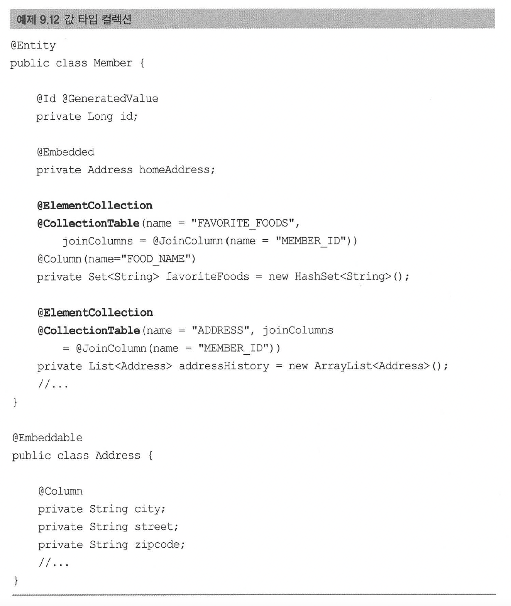

  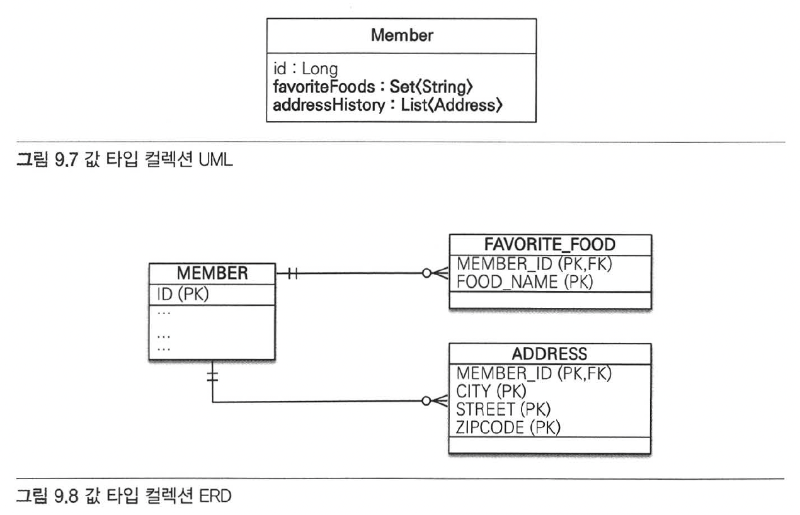

- 예제 9.12 의 Member 엔티티를 보면, 값 타입 컬렉션을 사용하는 favoriteFoods, addressHistory에 @ElementCollection 지정.
- favoriteFoods 는 기본값 타입인 String을 컬렉션으로 가짐.
- 이것을 DB테이블로 매핑해야 하는데 RDB의 테이블은 컬럼 안에 컬렉션 포함 불가능.
- 따라서 그림 9.8처럼 별도의 테이블을 추가하고 @CollectionTable를 사용해서 추가한 테이블을 매핑해야 함.


### 9.5.1 값 타입 컬렉션 사용

  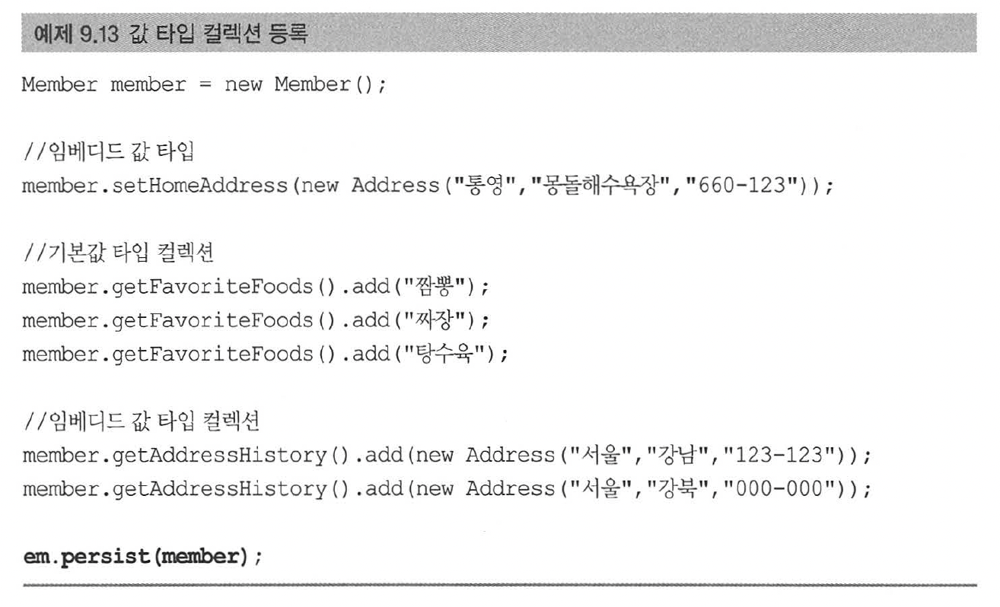
- 마지막에 member 엔티티만 영속화함.  
- JPA는 이 때 member 엔티티의 값 타입도 함께 저장함.  
- 실제 데이터베이스 insert sql 은 다음과 같음.  
    a. member : insert sql 1번   
    b. member.homeAddress : 컬렉션이 아닌 임베디드 값 타입이므로 회원 테이블을 저장하는 SQL에 포함.  
    c. member.favoriteFoods : insert sql 3번  
    d. member.addressHistory : insert sql 2번  

- 따라서 em.persist(member) 한 번 호출로 총 6번의 insert sql을 실행.  
  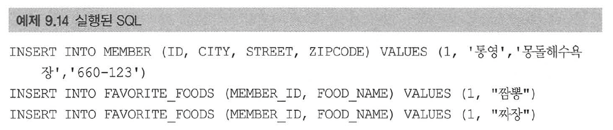
  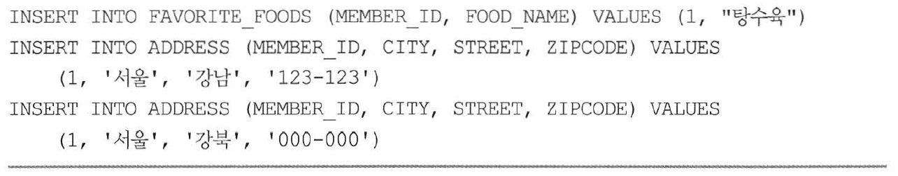

- 값 타입 컬렉션도 조회할 때 페치 전략을 선택할 수 있음. LAZY가 기본.    
  @ElementCollection(fetch = FetchType.LAZY)  

- 지연 로딩으로 모두 설정했다고 가정하고, 아래 예제 9.15 실행하면?  
  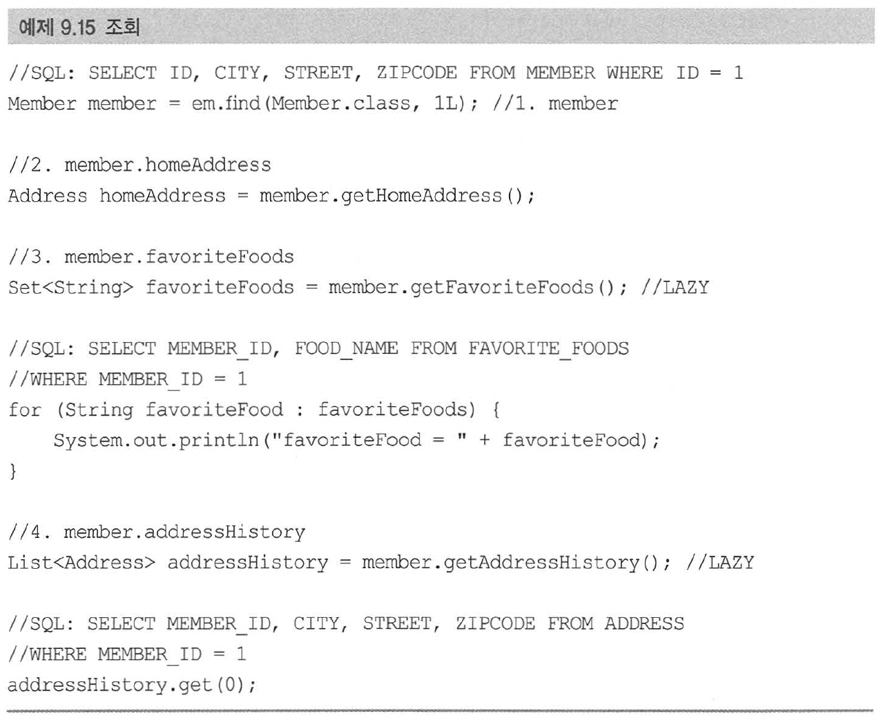
    a. member : 회원만 조회. 임베디드 값 타입인 homeAddress 도 함께 조회. select sql 1번  
    b. member.homeAddress : 1번에서 회원을 조회할 때 같이 조회해 둠.  
    c. member.favoriteFoods : LAZY로 설정해서 실제 컬렉션을 사용할 때 select sql 1번 호출  
    d. member.addressHistory : LAZY로 설정해서 실제 컬렉션을 사용할 때 select sql 1번 호출  

- 그렇다면, 값 타입 컬렉션을 수정하면 어떻게 되는지?
  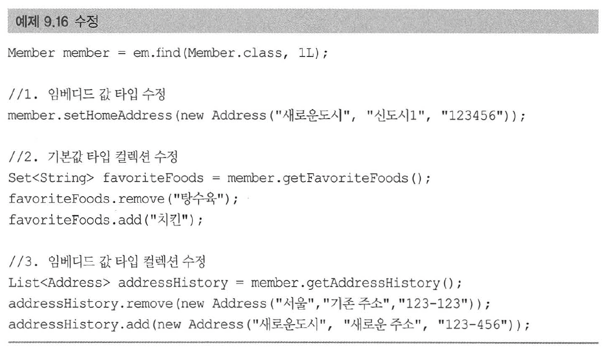
    a. 임베디드 값 타입 수정 : homeAddress 임베디드 값 타입은 MEMBER 테이블과 매핑했으므로 MEMBER 테이블만 업데이트. Member 엔티티를 수정하는 것과 같음.  
    b. 기본값 타입 컬렉션 수정 : 탕수육을 치킨으로 변경하려면 탕수육 제거 후 치킨 추가해야 함. 자바 String 타입은 수정할 수 없음.  
    c. 임베디드 값 타입 컬렉션 수정 : 값 타입은 불변해야하므로, 컬렉션에서 기존 주소를 삭제하고 새로운 주소 등록. 값 타입은 equals, hashcode를 꼭 구현해야 함.  


### 9.5.2 값 타입 컬렉션의 제약사항

- 엔티티는 식별자가 있으므로 엔티티 값을 변경해도 식별자로 데이터베이스에 저장된 원본 데이터를 쉽게 찾아 변경 가능.
- 값 타입은 식별자라는 개념이 없고 단순 값들의 모음이므로 값을 변경해버리면 데이터베이스에 저장된 원본 데이터를 찾기 어려움.

- 특정 엔티티 하나에 소속된 값 타입은 값이 변경되어도 자신이 소속된 엔티티를 데이터베이스에서 찾고 값을 변경하면 됨.
- 값 타입 컬렉션에 보관된 값 타입들은 별도의 테이블에 저장됨.
- 여기에 보관된 값 타입의 값이 변경되면, 데이터베이스에 있는 원본 데이터를 찾기 어려움.
- 따라서 JPA 구현체들은 값 타입 컬렉션에 변경 사항이 발생하면, 값 타입 컬렉션이 매핑된 테이블의 연관된 모든 데이터를 삭제하고, 모든 값을 다시 저장함.
- 예를 들어, 식별자가 100번인 회원이 관리하는 주소 값 타입 컬렉션을 변경하면, 100번과 관련된 모든 주소데이터를 삭제하고, 현재 값 타입 컬렉션에 있는 값을 다시 저장함.
- 따라서 실무에서는 값 타입 컬렉션이 매핑된 테이블에 데이터가 많다면, 값 타입 컬렉션 대신 일대다 관계를 고려해야 함.
- 값 타입 컬렉션을 매핑하는 테이블은 모든 컬럼을 묶어서 기본 키를 구성해야 함.
- 데이터베이스 기본 키 제약 조건으로 인해 컬럼에 null 입력이 불가능하고, 같은 값을 중복해서 저장할 수 없음.

- 위 이슈들을 해결하려면 값 타입 컬렉션을 사용하는 대신에 아래 예제 9.17처럼 새로운 엔티티를 만들어 일대다 관계로 설정해야 함.
- 영속성 전이(cascade) + 고아 객체 제거(ORPHAN REMOVE) 기능을 적용하면 값 타입 컬렉션처럼 사용할 수 있음.

  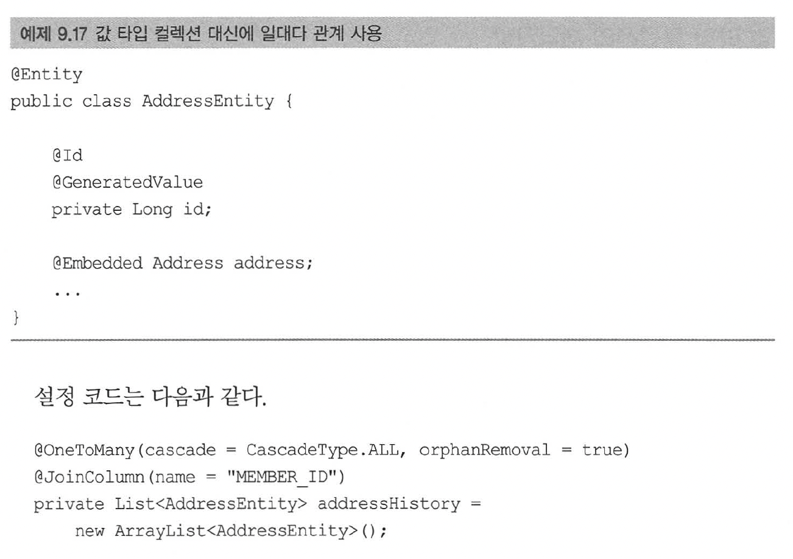


## 9.6. 정리

### 엔티티 타입의 특징
- 식별자(@id)가 있다 : 엔티티 타입은 식별자가 있고 식별자로 구별 가능.  
- 생명 주기가 있다 : 생성, 영속화, 소멸하는 생명 주기가 있음.  
- 공유할 수 있다 : 참조값을 공유할 수 있음.(공유 참조)  

### 값 타입의 특징
- 식별자가 없음.  
- 생명 주기를 엔티티에 의존함. : 의존하는 엔티티 제거시 같이 제거됨.  
- 공유하지 않는 것이 안전함. : 값을 복사해서 사용해야하며, 오직 하나의 주인만이 관리해야 함. 불변 객체로 만드는 것이 안전함.

