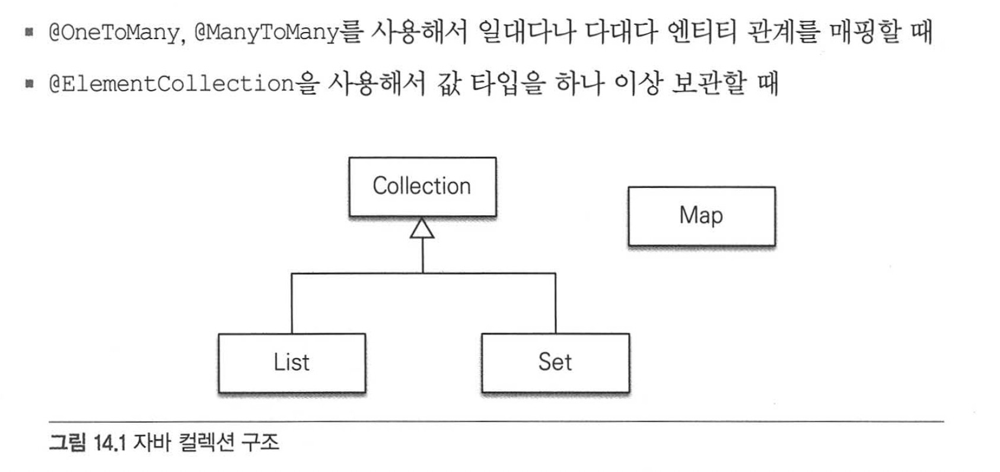
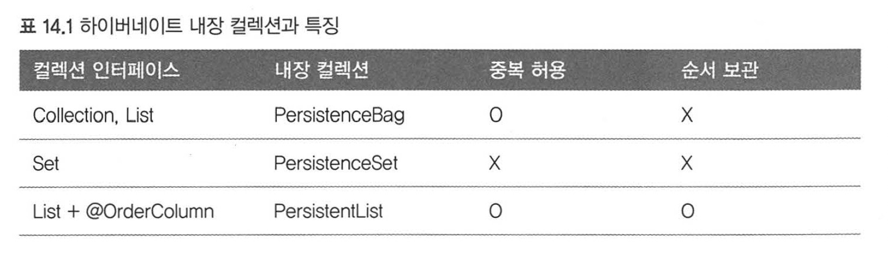
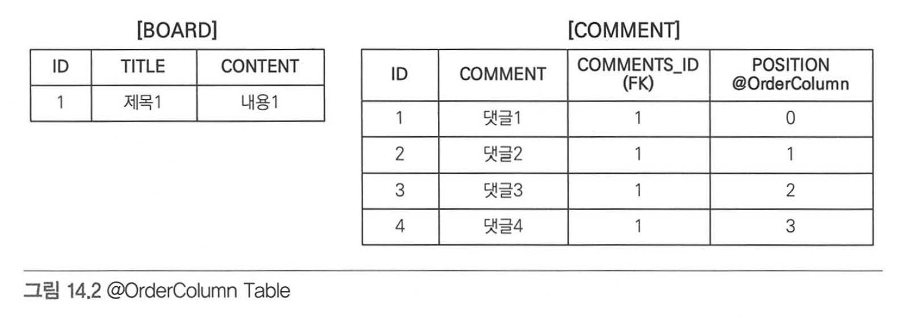

# Chapter 14 "컬렉션과 부가 기능"

* 컬렉션 : 다양한 컬렉션과 특징 설명.
* 컨버터 : 엔티티의 데이터를 변환하여 데이터베이스에 저장.
* 리스너 : 엔티티에서 발생한 이벤트 처리.
* 엔티티 그래프 : 엔티티를 조회할때 연관된 엔티티를 선택하여 함께 조회.


---
## 14.1 컬렉션

- JPA는 자바에서 기본으로 제공하는 Collection, List, Set, Map 컬렉션을 지원함.
  1) @OneToMany, @ManyToMany를 사용해서 일대다나 다대다 엔티티 관계를 매핑할 때
  2) @ElementCollection을 사용해서 값 타입을 하나 이상 보관할 때

  


- 자바 컬렉션 인터페이스의 특징
  1) Collection : 최상위 컬렉션. 하이버네이트는 중복을 허용하고 순서를 보장하지 않는다고 가정. 
  2) Set : 중복을 허용하지 않는 컬렉션. 순서를 보장하지 않음.
  3) List : 순서가 있는 컬렉션. 순서를 보장하며 중복을 허용함.
  4) Map : Key, Value 구조로 되어있는 특수한 컬렉션.


### 14.1.1 JPA와 컬렉션

  - 하이버네이트는 엔티티를 영속 상태로 만들 때 컬렉션 필드를 하이버네이트에서 준비한 컬렉션으로 감싸서 사용.
    ``` 예제 14.1
    @Entity
    public class Team {
            @Id
            private String id;
            
            @OneToMany
            @JoinColumn
            private Collection<Member> members = new ArrayList<Member>();
            ...
    }
    ```
    
  - 위 예제에서 Team은 members 컬렉션을 필드로 가지고 있음. 다음 코드로 Team을 영속상태로 만들면 출력결과는 다음과 같음.
    ```
    //실행 코드
    Team team = new Team();
    
    System.out.println("before persist = "+ team.getMembers().getClass());
    em.persist(team);
    System.out.println("after persist = " + team.getMebers().getClass());
    
    //출력 결과
    before persist = class java.util.ArrayList 
    after persist = class org.hibernate.collection.internal.PersistentBag
    ```

  - 원래 ArrayList 타입이었던 컬렉션이 엔티티를 영속상태로 만든 직후에 하이버네이트가 제공하는 PersistentBag 타입으로 변경되었음.
  - 하이버네이트는 컬렉션을 효율적으로 관리하기 위해 엔티티를 영속 상태로 만들 때 원본 컬렉션을 감싸고 있는 내장 컬렉션을 생성해서   
    이 내장 컬렉션을 사용하도록 참조를 변경함. 래퍼 컬렉션이라고도 부름. 
  - 따라서 컬렉션 사용시 다음처럼 즉시 초기화하여 사용하는 것을 권장함.
    ```
    Collection<Member> members = new ArrayList<Member>();
    ```
    
  


### 14.1.2 Collection, List

  - Collection, List 인터페이스는 중복을 허용하는 컬렉션이고, PersistentBag을 래퍼 컬렉션으로 사용.
    - 아래 예제와 같이 ArrayList로 초기화 하면 됨.
      ``` 예제 14.3
      //Entity
      ...
      @OneToMany
      @JoinColumn
      private Collection<CollectionChild> collection = new ArrayList<CollectionChild>();
    
      @OneToMany
      @JoinColumn
      private List<ListChild> list = new ArrayList<ListChild>();
      ```
    
  - Collection, List는 중복을 허용한다고 가정하므로 객체를 추가하는 add() 메소드는 내부에서 어떤 비교도 하지 않고 true 반환.
  - 엔티티 추가시 중복 엔티티 비교하지 않고 단순 저장만 하면 됨.
  - 엔티티 추가해도 지연 로딩된 컬렉션을 초기화하지 않음.


### 14.1.3 Set
  - Set은 중복을 허용하지 않는 컬렉션.
  - 하이버네이트는 PersistentSet을 컬렉션 래퍼로 사용함.
  - HashSet으로 초기화하면 됨.
    ``` 예제 14.4
    @Entity
    public class Parent {
            @OneToMany
            @JoinColumn
            private Set<SetChild> set = new HashSet<SetChild>();
            ...
    }
    ```
    
  - HashSet은 중복을 허용하지 않으므로 add() 메소드로 객체를 추가할 때 마다 equals() 메소드로 같은 객체가 있는지 비교함.
  - HashSet은 해시 알고리즘을 사용하므로 hashcode()도 함께 사용해서 비교함.
  - Set은 엔티티를 추가할 때 중복된 엔티티가 있는지 비교해야 함. 
  - 엔티티를 추가할 때 지연 로딩된 컬렉션을 초기화 함.


### 14.1.4 List + @OrderColumn

  - List 인터페이스에 @OrderColumn을 추가하면 순서가 있는 특수한 컬렉션으로 인식됨.
  - 순서가 있다는 것은, 데이터베이스에 순서값을 저장해서 조회할 때 사용한다는 의미.
  - 하이버네이트는 내부 컬렉션인 PersistentList를 사용함.
    ``` 예제 14.5
    Entity
    public class Board {
            @Id @GeneratedValue
            private Long id;
    
            private String title;
            private String content;
            
            @OneToMany(mappedBy = "board")
            @OrderColumn(name = "POSITION")
            private List<Comment> comments = new ArrayList<Comment>()
            ...
    }
    
    @Entity
    public class Comment {
            @Id @GeneratedValue
            private Long id;
    
            private String comment;
    
            @ManyToOne
            @JoinColumn(name = "BOARD_ID")
            private Board board;
    
            ...
    }
    
    //사용 코드
    list.add(1, data1); //1번 위치에 data1 저장
    list.add(data1);
    list.get(10); //10번 위치에 있는 값 조회
    ```
    
  - 순서가 있는 컬렉션은 데이터베이스에 순서값도 함께 관리함.
  - 여기서는 @OrderColumn의 name 속성에 POSITION이라는 값을 주었고, JPA는 List의 위치값을 테이블의 POSITION 컬럼에 보관함.
  - Board.comments 컬렉션은 BOARD 엔티티에 있지만, 테이블의 일대다 관계의 특성상 위치값은 다(N)쪽에 저장해야 하므로 POSITION 컬럼은 COMMENT 테이블에 매핑.
  

  - @OrderColumn을 사용해서 List의 위치값을 보관하면 편리할 것 같지만, 단점이 많음.
  - @OrderColumn 사용보다는 개발자가 직접 POSITION 값을 관리하거나, @OrderBy를 사용할 것을 권장함.

  - @OrderColumn 의 단점 (실무에서 사용하지 않는 이유)
    1) POSITION값을 업데이트하는 SQL이 추가로 발생함.
    2) 댓글2를 삭제하면 댓글3,4의 POSITION값을 하나씩 줄이는 업데이트 SQL이 각각 실행되어야 함.
    3) 중간에 POSITION값이 없으면 조회한 List에는 null이 보관되어, 컬렉션을 순회할 때 NPE가 발생함.


### 14.1.5 @OrderBy

  - @OrderColumn이 데이터베이스에 순서용 컬럼을 매핑해서 관리했다면, @OrderBy는 데이터베이스의 OrderBy 절을 사용해서 컬렉션을 정렬함.
    ``` 예제 14.7
    @Entity
    public class Team {
            @Id @GeneratedValue
            private Long id;
            private String name;
    
            @OneToMany(mappedBy = "team")
            @OrderBy("username desc, id asc")
            private Set<Member> members = new HashSet<Member>();
            ...
    }
    
    @Entity
    public class Member {
            @Id @GeneratedValue
            private Long id;
    
            @Column(name = "MEMBER_NAME")
            private String username;
    
            @ManyToOne
            private Team team;
            ...
    }
    ```
    


---
## 14.2 @Converter

- Converter를 사용하면 엔티티의 데이터를 변환해서 데이터베이스에 저장할 수 있음.
- ex) boolean을 데이터베이스에 저장하면 0 또는 1로 저장되겠지만, 컨버터를 이용하면 Y, N으로 저장 가능.

    ``` 예제 14.8
    CREATE TABLE MEMBER (
        ID        VARCHAR(255) NOT NULL,
        USERNAME  VARCHAR(255),
        VIP       VARCHAR(1)   NOT NULL,
        PRIMARY KEY (ID)
    )
    ```
  
    ``` 예제 14.9
    @Entity
    public class Member {
            @Id
            private String id;
            private String username;
    
            @Convert(converter=BooleanToYNConverter.class)
            private boolean vip;
    
            //Getter, Setter
            ...
    }
    ```

    ``` 예제 14.10
    @Convert
    public class BooealnToYnConverter implements AttributeConverter<Booelan, String> {
    
            @Override
            public String convertToDatebaseColumn(Boolean attribute) {
                    return (attribute != null && attribute) ? "Y" : "N";
            }
    
            @Override
            public Boolean convertToEntityAttribute(String dbData) {
                    return "Y".equals(dbData);
            }
    }
    ```
 
    - 컨버터 클래스에 @Converter 어노테이션 사용
    - AttributeConverter 인터페이스 구현
    - 제네릭에 현재타입과 변환할 타입 지정 (여기서는 <Boolean, String>으로 지정하여 Boolean을 String으로 변환)

    ``` 예제 14.11
    public interface AttributeConverter<X, Y> {
        public Y convertToDatabaseColumn (X attribute);
        public X convertToEntityAttribute (Y dbData);
    }
    ```

    - convertToDatabaseColumn() : 엔티티의 데이터를 DB 컬럼에 저장할 데이터로 변환. true -> Y, false -> N.
    - convertToEntityAttribute() : DB에서 조회한 컬럼 데이터를 엔티티의 데이터로 변환. Y -> true, N -> false.

    ``` 예제 14.12
    @Entity
    @Convert(converter=BooleanToYNConverter.class, attributeName = "vip")
    public class Member {
            @Id
            private String id;
            private String username;
    
            private boolean vip;
            ...
    }
    ```
  
### 14.2.1 글로벌 설정

  - 모든 Boolean 타입에 컨버터를 적용하려면 @Converter(AutoApply = true) 옵션을 적용.
    ``` 예제 14.13
    @Converter(autoApply = true)
    public class BooleanToYNConverter implements AttributeConverter<Boolean, String> {
            ...
    }
    ```
  - 각 엔티티의 변수에 @Converter 붙이지 않아도 전역으로 적용됨.


---
## 14.3 리스너

- JPA리스너 기능을 사용하면 엔티티 생명주기에 따른 이벤트를 처리할 수 있음.  
  ex) 모든 엔티티 대상으로 언제 어떤 사용자가 삭제를 요청했는지 모두 로그로 남겨주세요.


### 14.3.1 이벤트 종류

   // 그림14.3 대체

  1. PostLoad : 엔티티가 영속성 컨텍스트에 조회된 직후 or Refresh를 호출한 후.
  2. PrePersis : persist() 메소드를 호출해 엔티티를 영속성 컨텍스트에 관리하기 직전에 호출됨. 새로운 인스턴스 merge 할때도 수행.
  3. PreUpdate : flush나 commit을 호출하여 엔티티를 DB에 수정하기 직전에 호출됨.
  4. PreRemove : remove() 메소드를 호출해서 엔티티를 영속성 컨텍스트에서 삭제하기 직전에 호출.   
                 삭제 명령어로 영속성 전이가 일어날때도 호출. orphanRemoval에 대해서는 flush나 commit시 호출됨.
  5. PostPersist : flush나 commit을 호출하여 엔티티를 DB에 저장한 직후에 호출됨. 식별자가 항상 존재.
  6. PostUpdate : flush나 commit을 호출하여 엔티티를 DB에 수정한 직후에 호출됨.
  7. PostRemove : flush나 commit을 호출하여 엔티티를 DB에 삭제한 직후에 호출됨.


### 14.3.2 이벤트 적용 위치

  - 이벤트는 엔티티에서 직접 받거나, 별도의 리스터 등록하여 받을 수 있음.

  1) 엔티티에 직접 적용
     ``` 예제 14.15
     @Entity
     public class Duck {
         @Id @GeneratedValue
         public Long id;
    
         private String name;
    
         @PrePersist
         public void prePersist() {
                 System.out.println("Duck.prePersist id=" + id);
         }
    
         @PostPersist
         public void postPersist() {
                 System.out.println("Duck.postPersist id=" + id);
         }
    
         @PostLoad
         public void postLoad() {
                 System.out.println("Duck.postLoad");
         }
    
         @PreRemove
         public void preRemove() {
                 System.out.println("Duck.preRemove");
         }
    
         @PostRemove
         public void postRemove() {
                 System.out.println("Duck.postRemove");
         }
     }
     ```
     엔티티 저장시 다음과 같이 출력됨.
     Duck.prePersist id=null (아이디 생성 전 호출됨)
     Duck.postPersist id=1 (아이디 생성 후 호출됨)


  2) 별도의 리스터 등록
     ``` 예제 14.16
    @Entity
    @EntityListeners(DuckListener.class)
    public class Duck {
            ...
    }
    
    public class DuckListener {
            @PrePersist
            //특정 타입이 확실하면 특정 타입을 받을 수 있다.
            private void prePersist(Object obj) {
                    System.out.println("DuckListener.prePersist obj = [" + obj + "]");
            }
    
            @PostPersist
            //특정 타입이 확실하면 특정 타입을 받을 수 있다.
            private void postPersist(Object obj) {
                    System.out.println("DuckListener.postPersist obj = [" + obj + "]");
            }
    }
     ```
     - 리스너는 대상 엔티티를 파라미터로 받을 수 있음. 반환타입은 void 로 설정해야 함.


  3) 기본 리스너 사용
     - META-INF/orm.xml 에 default 리스터로 등록.
     ``` 예제 14.17
     <?xml version"1.0" encoding="UTF-8" ?>
        <entity-mappings ...>
        
                <persistence-unit-metadata>
                        <persistence-unit-defaults>
                                <entity-listeners>
                                        <entity-listener class="jpabook.jpashop.domain.
                                                listener.DefaultListner" />
                                </entity-listeners>
                        </persistence-unit-defaults>
                </persistence-unit-metadata>
        
        </entity-mappings>
     ```

  - 리스너 우선순위
    1) 기본리스너
    2) 부모 클래스 리스너
    3) 리스터
    4) 엔티티

  - 더 세밀한 설정
    1) javax.persistence.ExcludeDefaultListeners : 기본 리스너 무시
    2) javax.persistence.ExcludeSuperclassListeners : 상위 클래스 이벤트 리스너 무시
     ``` 예제 14.17
     @Entity
     @EntityListeners(DuckListener.class)
     @ExcludeDefaultListeners
     @ExcludeSuperclassListeners
     public class Duck extends BaseEntity {
         ...
     }
     ```


---
## 14.4 엔티티 그래프

- 엔티티 조회시 연관된 엔티티를 함께 조회하려면 글로벌 fetch 옵션을 FetchType.EAGER로 설정
    ```
    @Entity
    class Order {
            @ManyToOne(fetch=FetchType.EAGER)
            Member member;
            ...
    }
    ```
  
  - 또는 JPQL에서 페치 조인을 사용
    ```
    select o from Order o join fetch o.member
    ```
- 글로벌 옵션은 애플리케이션 전체에 영향을 줌. 따라서 FetchType.LAZY를 쓰고 필요할때 JPQL 페치조인 사용.
- JPQL이 데이터 조회뿐 아니라 연관 엔티티를 함께 조회하는 기능도 제공하기 때문에 JPQL을 중복해서 많이 사용.  
- 연관된 엔티티를 함께 조회하는 기능은 엔티티 그래프 사용 권장. 엔티티 그래프 기능은 엔티티 조회시점에 연관된 엔티티들을 함께 조회하는 기능.

### 14.4.1 Named 엔티티 그래프

  - 주문(Order)을 조회할 때 연관된 회원(Member)도 함께 조회하는 엔티티 그래프 예시
    ``` 예제 14.19
    @NamedEntityGraph(name = "Order.withMember", attributeNodes = {
            @NamedAttributeNode("member")
    })
    @Entity
    @Table(name = "ORDERS")
    public class Order {
            @Id @GeneratedValue
            @Column(name = "ORDER_ID")
            private Long id;
    
            @ManyToOne(fetch = FetchType.LAZY, optional = false)
            @JoinColumn(name = "MEMBER_ID")
            private Member member;
    
            ...
    }
    ```
  - Named 엔티티 그래프는 @NamedEntityGraph로 정의함.
  - name : 엔티티 그래프의 이름을 정의.
  - attributeNodes : 함께 조회할 속성 선택. @NamedAttributeNode를 사용하고 그 값으로 함께 조회할 속성을 선택.

  - 지연로딩 설정이지만 엔티티 그래프 설정으로 Order를 조회할 때 member도 함께 조회 가능.
  - 둘 이상 정의하려면 NamedEntityGraphs를 사용하면 됨.


### 14.4.2 em.find()에서 엔티티 그래프 사용

  - 엔티티 그래프 사용
    ``` 예제 14.20
    EntityGraph graph = em.getEntityGraph("Order.withMember");
    
    Map hints = new HashMap();
    hints.put("javax.persistence.fetchgraph", graph);
    
    Order order = em.find(Order.class, orderId, hints);
    ```
  - Named 엔티티 그래프를 사용하려면 정의한 엔티티그래프를 em.getEntityGraph("Order.withMember")를 통해 찾아오면 됨.
  - JPA의 힌트 기능을 사용해서 동작함. 힌트 키는 javax.persistence.fetchgraph 를 사용.
    
    ```
    //실행된 SQL
    select o.*, m.*
    from
            ORDERS o
    inner join
            Member m
                on o.MEMBER_ID = m.MEMBER_ID
    where
            o.ORDER_ID = ?
    ```
  - Order.withMember 엔티티 그래프를 사용해서 Order 와 Member를 함께 조회함.  


### 14.4.3 subgraph

- Order → OrderItem → Item까지 조회하는 경우 subgraph를 사용
    ```
    @NameEntityGraph(name = "Order.withAll", attributeNodes = {
        @NameAttributeNode("member"),
        @NameAttributeNode(value = "orderItems", subgraph = "orderItems")
        },
        subgraphs = @NamedSubgraph(name = "orderItems", attributeNodes = {
            @NameAttributeNode("item")
        })
    )
    @Entity
    @Table(name ="ORDERS")
    public class Order {
        @Id @GeneratedValue
        @Column(name = "ORDER_ID")
        private Long id;
        
        @ManyToOne(fetch = FetchType.LAZY, optional = false)
        @JoinColumn(name = "MEMBER_ID")
        private Member member; //주문 회원
        
        @OneToMany(mappedBy = "order", cascade = CascadeType.ALL)
        private List<OrderItem> orderItems = new ArrayList<OrderItem>();
        
        ...
    }
    
    @Entity
    @Table(name = "ORDER_ITEM")
    public class OrderItem {
        @Id @GeneratedValue
        @Column(name = "ORDER_ITEM_ID")
        private Long id;
        
        @ManyToOne(fetch = FetchType.LAZY)
        @JoinColumn(name = "ITEM_ID")
        private Item item; //주문 상품
        
        ...
    }
    ```
  - OrderItem → Item은 Order의 객체 그래프가 아니므로 subgraphs 속성 정의가 필요. 
  - @NamedSubgraph를 사용해서 서브 그래프를 정의.
    
  - 사용코드 예시
    ```
    Map hints = new HashMap();
    hints.put("javax.persistence.fetchgraph", em.getEntityGraph("order.withAll"));
    
    Order order = em.find(Order.class, orderId, hints);
    ```
    
    ```
    //실행된 쿼리
    select o.*, m.*, oi.*, i.*
    from
            ORDERS o
    inner join
            Member m
                    on o.MEMBER_ID = m.MEMBER_ID
    left outer join
            ORDER_ITEM oi
                    on o.ORDER_ID = oi.ORDER_ID
    left outer join
            Item i
                    on oi.ITEM_ID = i.ITEM_ID
    where
            o.ORDER_ID = ?
    ```


### 14.4.4 JPQL에서 엔티티 그래프 사용

  - em.find()와 동일하게 힌트만 추가하면 사용 가능
    
    ```
    List<Order> resultList = 
		em.createQuery("select o from Order o where o.id = :orderId", Order.class)
				.setParameter("orderId", orderId)
			    .setHint("javax.persistence.fetchgraph", em.getEntityGraph("Order.withAll")) // 요기
				.getResultList();
    ```
    
    
    ```
    // 실행된 쿼리
    select o.*, m.*, oi.*, i.*
    from
            ORDERS o
    left join
            Member m
                    on o.MEMBER_ID = m.MEMBER_ID
    left outer join
            ORDER_ITEM oi
                    on o.ORDER_ID = oi.ORDER_ID
    left outer join
            Item i
                    on oi.ITEM_ID = i.ITEM_ID
    where
            o.ORDER_ID = ?
    ```

  - 참고) em.find()에서 필수 관계(optional = false)를 고려해서 내부 조인을 사용하지만 JPQL에서 엔티티 그래프를 사용할 때는 항상 SQL 외부 조인을 사용.
  - SQL 내부 조인을 사용하려면 내부 조인 명시가 필요

    ```
    select o 
    from Order o 
    join fetch o.member 
    where o.id = :orderId
    ```


### 14.4.5 동적 엔티티 그래프

  - 엔티티 그래프를 동적으로 구성하려면 createEntityGraph() 메소드를 사용.

    ```
    public <T> EntityGraph<T> createEntityGraph
    ```
    
  - 처음에 사용한 Named 엔티티 그래프 동적으로 재구성해보면,
    
    ```
    EntityGraph<Order> graph = em.createEntityGraph(Order.class);  // 여기
    graph.addAttributeNodes("member");
    
    Map hints = new HashMap()
    hints.get("javax.persistence.fetchgraph", graph);
    
    Order order = em.find(Order.class, orderId, hints);
    ```
    
  - 조금 더 복잡한 동적 엔티티 그래프 subgraph 예시
    
    ```
    EntityGraph<Order> graph = em.createEntityGraph(Order.class); // 여기
    graph.addAttributeNodes("member");
    Subgraph<OrderItem> orderItems = graph.addSubgraph("orderItems"); // 여기
    orderItems.addAttributeNodes("item");
    
    Map hints = new HashMap()
    hints.get("javax.persistence.fetchgraph", graph);
    
    Order order = em.find(Order.class, orderId, hints);
    ```


### 14.4.6 엔티티 그래프 정리

  - ROOT 에서 시작
    - 엔티티 그래프는 항상 조회하는 엔티티의 ROOT에서 시작

  - 이미 로딩된 엔티티
    - 영속성 컨텍스트에 엔티티가 이미 로딩되어 있으면 엔티티 그래프 적용되지 않음.
    ```
    Order order1 = em.find(Order.class, orderId);  //이미 조회

    hints.put("javax.persistence.fetchgraph", em.getEntityGraph("Order.withMember"));
    Order order2 = em.find(Order.class, orderId, hints);  //엔티티 그래프 적용되지 않음.
    ```
    
  - fetchgraph, loadgraph의 차이
    1) fetchgraph는 엔티티 그래프에 선택한 속성만 함께 조회
    2) loadgraph는 선택한 속성 + FetchType.EAGER로 설정된 연관관계도 함께 조회

    
