# Chapter 16 "트랜잭션과 락, 2차 캐시"

---
## 16.2 2차 캐시

### 16.2.1 1차 캐시와 2차 캐시

  - 네트워크를 통해 DB에 접근하는 시간 비용 > 애플리케이션 서버에서 내부 메모리에 접근하는 시간 비용   
    (수만에서 수십만 배 이상 차이)  
  - 따라서, 조회한 데이터를 메모리에 캐시해서 DB접근 횟수를 줄이면 성능을 개선할 수 있음.  

  - 1차 캐시 : 영속성 컨텍스트 내부에 있는 엔티티 보관하는 저장소  
  - 일반적인 웹 애플리케이션 환경은 트랜잭션을 시작하고 종료할 때까지만 1차 캐시가 유효함.  
  - OSIV를 사용해도 클라이언트의 요청이 들어올 때부터 끝날 때까지만 1차 캐시가 유효함.  
    (OSIV : https://ykh6242.tistory.com/entry/JPA-OSIVOpen-Session-In-View%EC%99%80-%EC%84%B1%EB%8A%A5-%EC%B5%9C%EC%A0%81%ED%99%94)
  - 따라서 애플리케이션 전체로 보면 DB접근 횟수를 유효하게 줄이지는 못함.  

  - 2차 캐시(공유 캐시) : 애플리케이션 범위의 캐시. 거의 대부분의 JPA구현체 지원함.  

    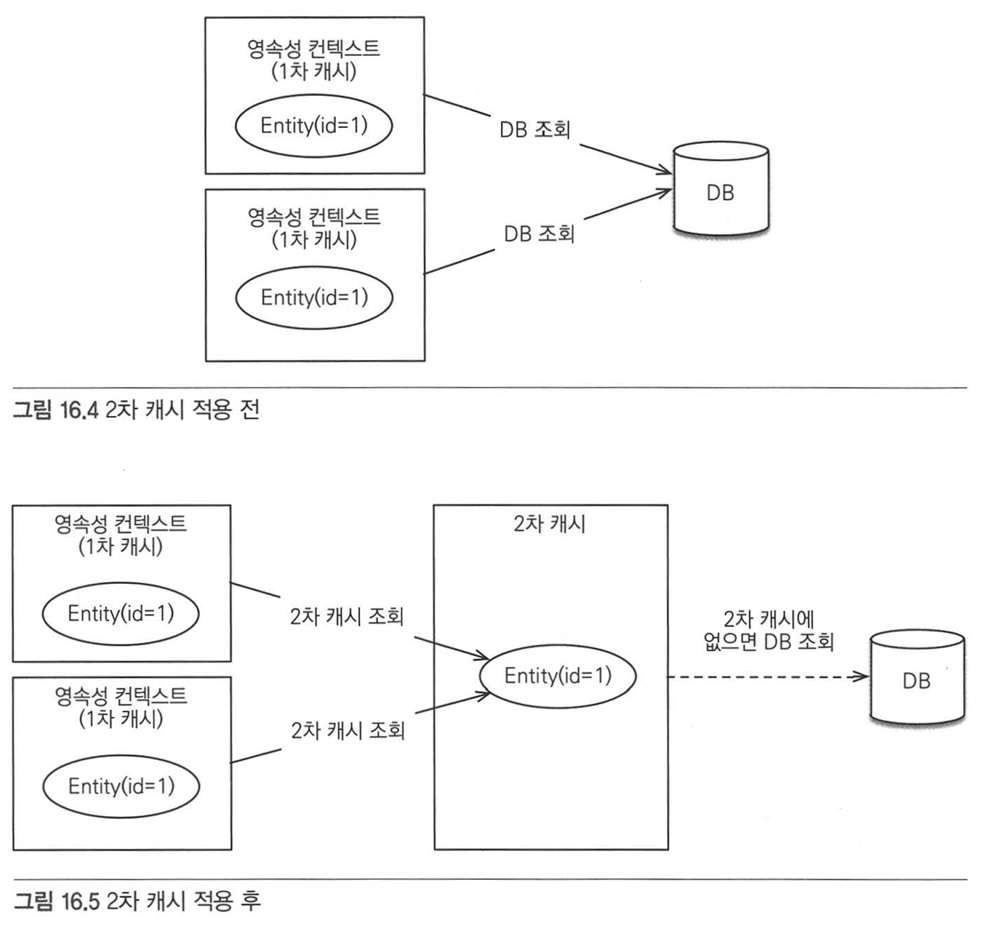
  
  
#### 1차 캐시

  - 1차 캐시는 영속성 컨텍스트 내부에 있음.
  - 엔티티 매니저로 조회하거나 변경하는 모든 엔티티는 1차 캐시에 저장됨.
  - 트랜잭션을 커밋하거나 플러시를 호출하면 1차 캐시에 있는 엔티티의 변경 내역을 DB에 동기화 함.
  - JPA를 J2EE나 스프링 프레임워크 같은 컨테이너 위에서 실행하면 트랜잭션을 시작할 때 영속성 컨텍스트를 생성하고  
    트랙잭션을 종료할 때 영속성 컨텍스트도 종료함.
  - OSIV를 사용하면 요청(ex. HTTP request)의 시작부터 끝까지 같은 영속성 컨텍스트를 유지함.
  - 영속성 컨텍스트 자체가 사실상 1차 캐시이기 때문에 켜고 끌 수 있는 옵션의 개념이 아님.

    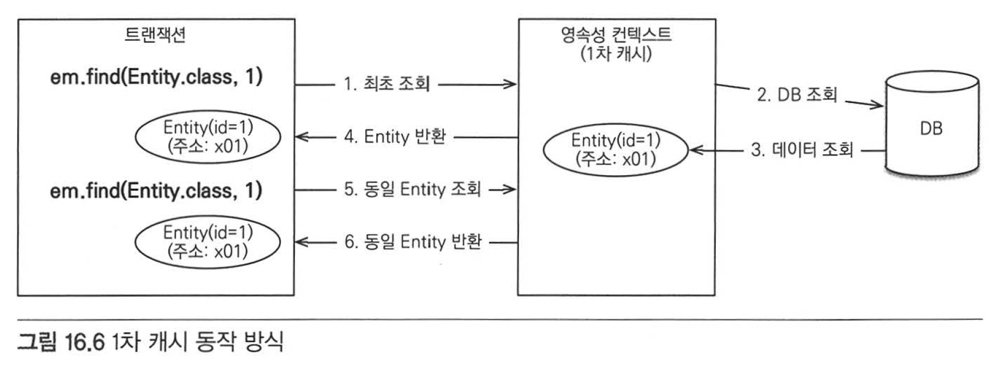


  - 1차 캐시 동작 방식
    1) 최초 조회할 때는 1차 캐시에 엔티티가 없으므로
    2) DB에서 엔티티 조회해서
    3) 1차 캐시에 보관하고
    4) 1차 캐시에 보관한 결과를 반환.
    5) 이후 같은 엔티티 조회시 DB조회하지 않고 1차 캐시의 엔티티 그대로 반환.  
  

  - 1차 캐시의 특징
    1) 같은 엔티티가 있으면 해당 엔티티를 그대로 반환. 객체 동일성(a==b)를 보장함.
    2) 영속성 컨텍스트 범위의 캐시임. (컨테이너 환경에서는 트랜잭션 범위의 캐시, OSIV를 적용하면 요청범위의 캐시)


#### 2차 캐시
  
  - 애플리케이션에서 공유하는 캐시를 2차 캐시라고 함. (JPA에서는 공유 캐시라고도 함)
  - 2차 캐시는 애플리케이션 범위의 캐시이므로 애플리케이션을 종료할 때까지 캐시가 유지됨.
  - 분산 캐시나 클러스터링 환경의 캐시는 애플리케이션보다 더 오래 유지 가능.
  - 2차 캐시를 적용하면, 엔티티 매니저를 통해 데이터를 조회할 때 우선 2차 캐시에서 찾고 없으면 DB에서 찾음.
  - 적절히 활용하면 DB 조회 횟수를 획기적으로 줄일 수 있음.

  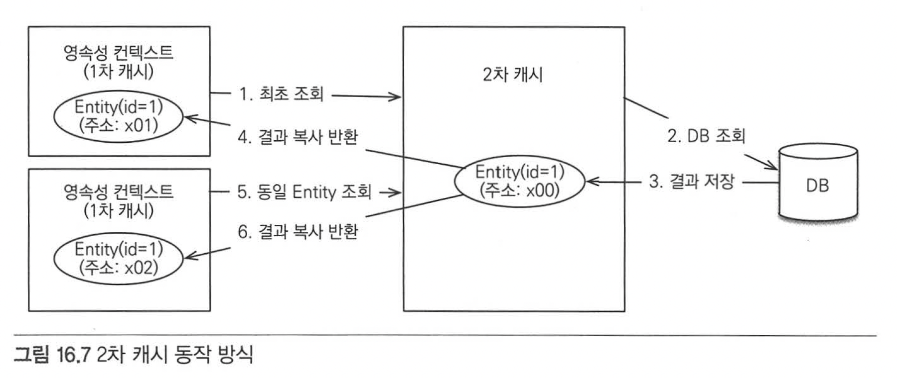

  - 2차 캐시 동작 방식
    1) 영속성 컨텍스트는 엔티티가 필요하면 2차 캐시를 조회함.
    2) 2차 캐시에 엔티티가 없으면 DB를 조회해서
    3) 결과를 2차 캐시에 보관하고
    4) 2차 캐시에 보관한 엔티티를 복사해서 반환함.
    5) 2차 캐시에 저장되어 있는 엔티티를 조회하면 복사본을 만들어 반환.

      * 2차 캐시는 동시성을 극대화하기 위해 캐시한 객체를 그대로 반환하지 않고 복사본을 만들어 반환함.
      * 캐시를 그대로 반환했을 경우 여러 곳에서 같은 객체를 동시에 수정하면 문제가 발생할 수 있기 때문. (이를 방지하기 위해 락을 걸 수 있지만, 동시성이 떨어짐.)


  - 2차 캐시의 특징
    1) 영속성 유닛 범위의 캐시
    2) 조회한 객체를 그대로 반환하지 않고, 복사본을 만들어 반환.
    3) DB 기본 키를 기준으로 캐시하지만, 영속성 컨텍스트가 다르면 객체 동일성(a==b)를 보장하지 않음.

    
### 16.2.2 JPA 2차 캐시 기능
(지금부터 '캐시'라고 하면 일반적으로 2차 캐시를 의미. 1차 캐시는 '1차 캐시'라고 명시하겠음.)  


#### 캐시 모드 설정

  - 2차 캐시를 사용하려면 엔티티에 javax.persistence.Cacheable 어노테이션을 사용하면 됨.  
  - @Cacheable은 @Cacheable(true), @Cacheable(false)를 설정할 수 있는데, 기본값은 true 임.  
    ``` 예제 16.6 캐시 모드 설정
    @Cacheable
    @Entity
    public class Member {
        
        @Id @GenerateValue
        private Long id;
        ....
    }
    ```  
  
  - persistence.xml 에 shared-cache-mode 를 설정하여 애플리케이션 전체(정확히는 영속성 유닛 단위) 캐시를 어떻게 적용할지 옵션을 설정해야 함.  
    ``` 예제 16.7 persistence.xml 에 캐시 모드 설정
    <persistence-unit name="test">
        <shared-cache-mode>ENABLE_SELECTIVE</shared-cache-mode>
    </persistence-unit>
    ```
    
   - 스프링 프레임워크 사용시 아래와 같이 셋팅.  
     ``` 예제 16.8 캐시 모드 스프링 프레임워크 XML 설정
       <bean id = "entityManagerFactory" class="org.springframework.orm.jpa.LocalContainerEntityManageFactoryBean">
           <property name="sharedCacheMode" value="ENABLE_SELECTIVE">
     ```
    
   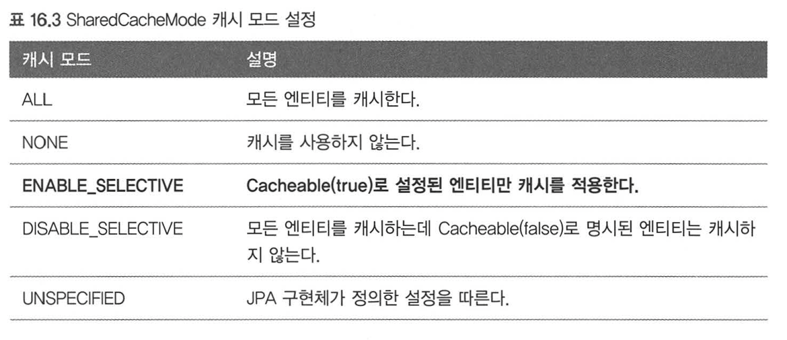


#### 캐시 조회, 저장 방식 설정

  - 캐시 무시하고 DB 직접 조회하거나 캐시를 갱신하려면 캐시 조회 모드 / 캐시 보관 모드 사용.  
    em.setProperty("javax.persistence.cache.retrieveMode", CacheRetrieveMode.BYPASS);


  - 캐시 조회 모드 프로퍼티 이름 : javax.persistence.cache.retrieveMode
  - 캐시 보관 모드 프로퍼티 이름 : javax.persistence.cache.storeMode  
  

  - 캐시 조회 모드 설정 옵션 : javax.persistence.CacheRetrieveMode
  - 캐시 보관 모드 설정 옵션 : javax.persistence.CacheStoreMode
    
    ``` 예제 16.9 캐시 조회 모드
    public enum CacheRetrieveMode {
        USE,     // USE : 캐시에서 조회. (기본값)
        BYPASS   // BYPASS : 캐시를 무시하고 데이터베이스에 직접 접근.
    }
    ```
    
    ``` 예제 16.10 캐시 보관 모드
    public enum CacheStoreMode {
        USE,     // USE : 조회한 데이터를 캐시에 저장. 조회한 데이터가 이미 캐시에 있으면 캐시 데이터를 최신상태로 갱신하지 않음. 트랜잭션을 커밋하면 등록 수정한 엔티티도 캐시에 저장. (기본값)
        BYPASS,  // BYPASS : 캐시에 저장하지 않음.
        REFRESH  // REFRESH : USE 전략에 추가로 DB에서 조회한 엔티티를 최신 상태로 다시 캐시함. 
    }
    ```

  - 캐시 모드는 EntityManager.setProperty()로 엔티티 매니저 단위로 설정하거나,
  - EntityManager.find(), EntityManager.refresh()에 더 세밀하게 설정할 수 있음.
  - Query.setHint() 에 사용할 수도 있음.

   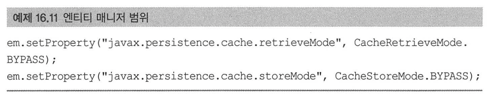
   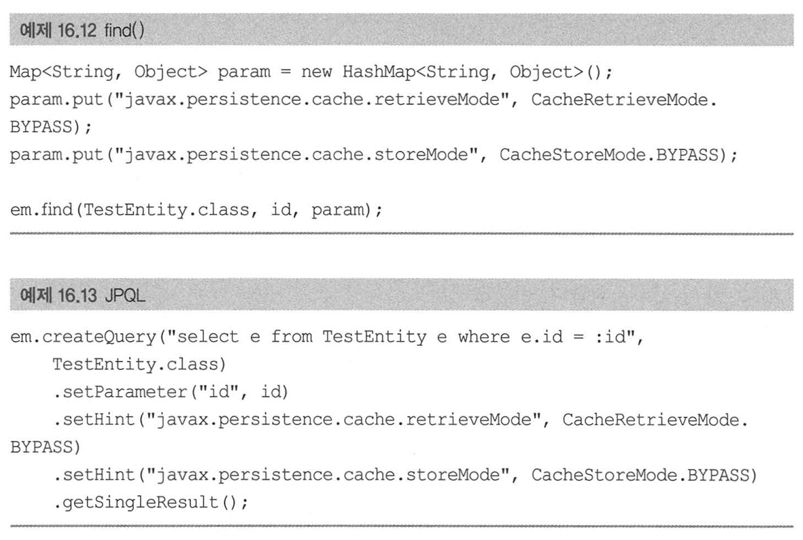
   


#### JPA 캐시 관리 API

  - JPA는 캐시를 관리하기 위한 javax.persistence.Cache 인터페이스를 제공함.
  - EntityManagerFactory에서 구할 수 있음.
   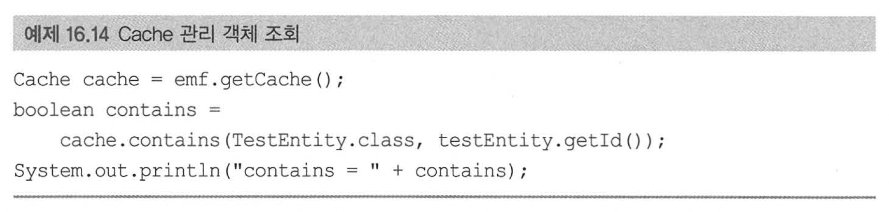
   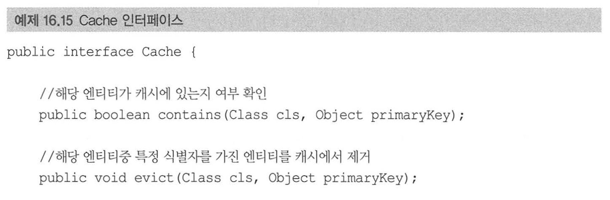
   .png)


### 16.2.3 하이버네이트와 EHCACHE 적용  
(하이버네이트와 EHCACHE를 사용해서 2차 캐시를 적용해보자.)

  - 하이버네이트가 지원하는 캐시
    1) 엔티티 캐시 : 엔티티 단위로 캐시. 식별자로 엔티티를 조회하거나 컬렉션이 아닌 연관된 엔티티 로딩시 사용.
    2) 컬렉션 캐시 : 엔티티와 연관된 컬렉션을 캐시. 컬렉션이 엔티티를 담고 있으면 식별자 값만 캐시. (하이버네이트 기능)
    3) 쿼리 캐시 : 쿼리와 파라미터 정보를 키로 사용하여 캐시. 결과가 엔티티면 식별자 값만 캐시 (하이버네이트 기능)


#### 환경설정

  - 하이버네이트에서 EHCACHE를 사용하려면 hibernate-ehcache 라이브러리를 pom.xml에 추가.
    ``` 예제 16.16 pom.xml 에 hibernate-ehcache 추가
      <dependency>
          <groupId>org.hibernate</groupId>
          <artifactId>hibernate-ehcache</artifactId>
          <version>4.3.10.Final</version>
      </dependency>
    ```

  - hibernate-ehcache를 추가하면 net.sf.ehcache-core 라이브러리도 추가됨.
  - ehcache.xml 설정파일은 캐시를 얼마만큼 보관할지, 얼마동안 보관할지와 같은 캐시 정책을 정의하는 설정파일.
  - 클래스 파일 루트은 src/main/resources 에 두면 됨.

  - 하이버네이트에 캐시 사용 정보를 설정하기 위해서는 persistence.xml 파일에 캐시 정보를 추가하면 됨.
    1) hibernate.cache.use_second_level_cache : 2차 캐시 활성화. 엔티티캐시와 컬렉션캐시 사용 가능해짐.
    2) hibernate.cache.use_query_cache : 쿼리 캐시 활성화.
    3) hibernate.cache.region.factory_class : 2차 캐시를 처리할 클래스를 지정. 여기서는 EHCACHE를 사용하므로 org.hibernate.cache.ehcache.EhCacheRegionFactory 를 적용.
    4) hibernate.generate_statistics : 이 속성을 true로 설정하면 하이버네이트가 여러 통계정보를 추출해주는데 캐시 적용 여부를 확인할 수 있음.


#### 엔티티 캐시와 컬랙션 캐시

   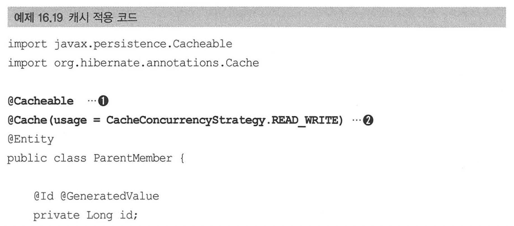
   .png)

  - javax.persistence.Cacheable : 엔티티를 캐시하려면 1번처럼 이 어노테이션을 적용.
  - org.hibernate.annotations.Cache : 2번처럼 캐시와 관련된 더 세밀한 설정을 할 때 사용. 혹은 3번처럼 컬랙션 캐시를 적용할때 사용. (하이버네이트 전용 어노테이션)
  - 여기서 ParentMember 는 엔티티 캐시가 적용되고, ParentMember.childMembers는 컬렉션 캐시가 적용됨.


#### @Cache

  - org.hibernate.annotations.Cache 를 사용하면 세밀한 캐시 설정이 가능.  
   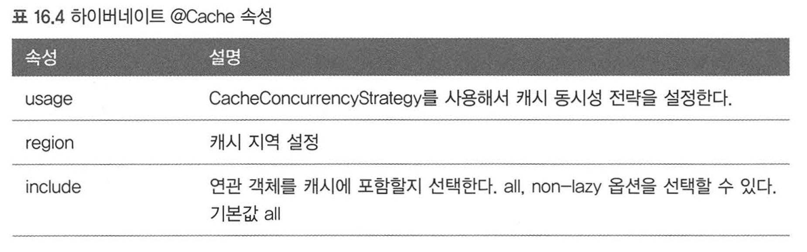

  - usage 속성을 사용하여 캐시 동시성 전략을 설정할 수 있음.  
   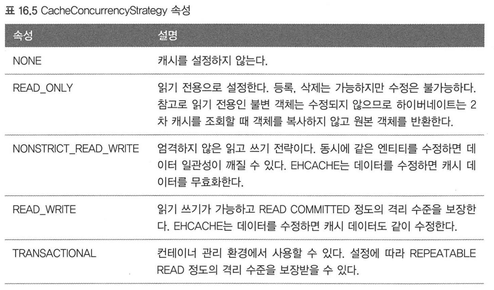

  - 캐시 종류에 따른 동시성 전략 지원 여부는 아래 표 참고.  
    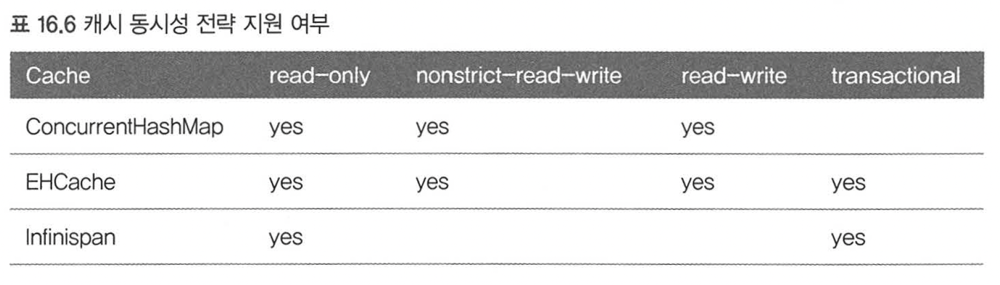
    (ConcurrentHashMap은 개발시에만 사용해야 함.)

    
#### 캐시 영역

  - 위에서 캐시를 적용한 코드는 다음의 캐시 영역(Cache Region)에 저장됨.
    1) 엔티티 캐시 영역 : jpabook.jpashop.domain.test.cache.ParentMember
    2) 컬렉션 캐시 영역 : jpabook.jpashop.domain.test.cache.ParentMember.childMembers
    
  - 엔티티 캐시 영역은 기본값으로 [패키지 명 + 클래스 명]을 사용하고,
  - 컬렉션 캐시 영역은 엔티티 캐시 영역 이름에 캐시한 컬렉션의 필드 명이 추가됨.
  - 캐시 영역을 위한 접두사 설정은 persistence.xml 설정에 hibernate.cache.region_prefix를 사용하면 됨.
    
    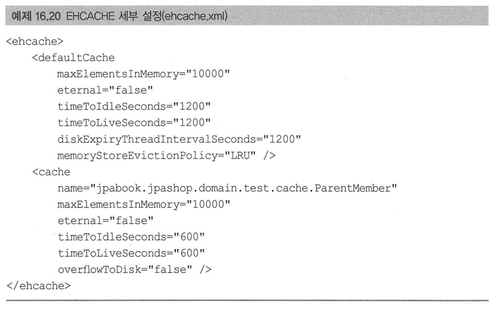


#### 쿼리 캐시

  - 쿼리 캐시는 파라미터 정보를 키로 사용해서 쿼리 결과를 캐시하는 방법.
  - 쿼리 캐시를 적용하려면 영속성 유닛을 설정에 hibernate.cache.use_query_cache 옵션을 꼭 true 로 설정해야 함.
    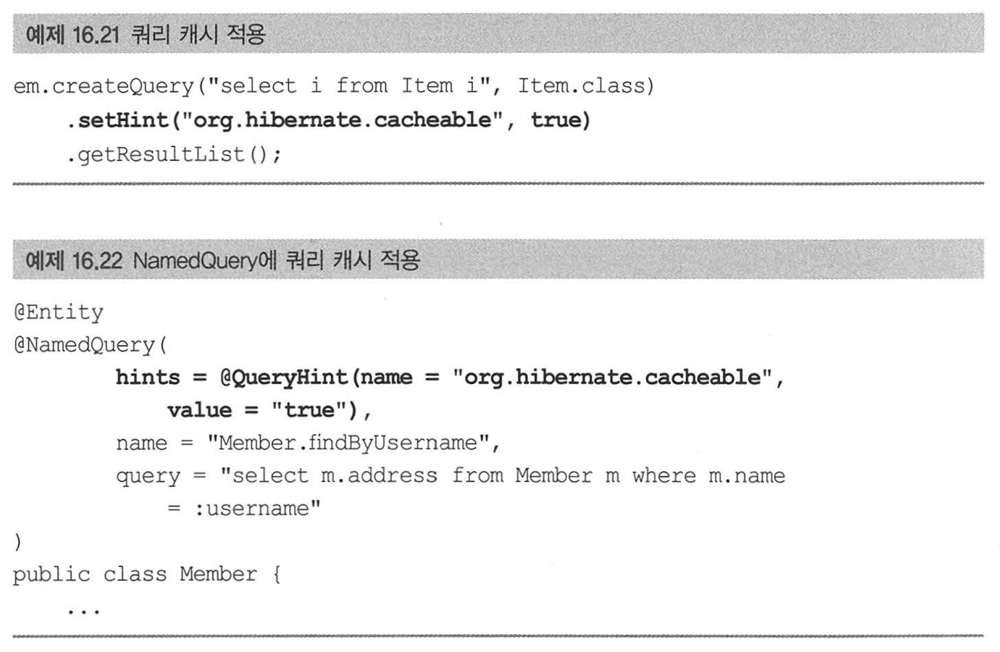


#### 쿼리 캐시 영역

  - hibernate.cache.use_query_cache 옵션을 true로 설정해서 쿼리 캐시를 활성화하면 다음 두 가지가 추가됨.
    1) org.hibernate.cache.internal.standardQuerycache : 쿼리 캐시를 저장하는 영역. 쿼리, 쿼리 결과 집합, 쿼리를 실행한 시점의 타임스탬프를 보관.
    2) org.hibernate.cache.spi.UpdateTimestampsCache : 쿼리 캐시가 유효한지 확인하기 위해 쿼리 대상 테이블의 가장 최근 변경(등록, 수정, 삭제) 시간을 저장 하는 영역. 테이블 명과 해당 테이블의 최근 변경된 타임스탬프를 보관.

  - 퀴리 캐시는 쿼리 캐시 실행 시간과 쿼리 캐시가 사용하는 테이블 최근 변경 시간을 비교. (최신 데이터를 유지하기 위함)
  - 쿼리 캐시가 사용하는 테이블에 조금이라도 변경이 있으면 DB에서 데이터를 읽어와서 퀴리 결과를 다시 캐시함.

  ``` 예제 16.23 쿼리 캐시 사용
  public List<ParentMember> findParentMembers() {
      return em.createQuery("select p from ParentMember p join p.childMembers c", ParentMember.class)
             .setHint("org.hibernate.cacheable", true)
             .getResultList();
  }
  ```

  - 위 쿼리 실행시
    1) StandardQueryCache 캐시 영역에서 타임스탬프를 조회.  
    2) 쿼리가 사용하는 엔티티의 테이블인 PARENTMEMBER, CHILDMEMBBR를 UpdateTimestampsCache 캐시 영역에서 조회해서 테이블들의 타임스탬프를 확인.  
    3) 이때 만약 standardQueryCache 캐시 영역의 타임스탬프가 더 오래되었으면 캐시가 유효하지 않은 것으로 보고 데이터베이스에서 데이터를 조회해서 다시 캐시.  

  - 쿼리 캐시를 잘 활용하면 극적인 성능 향상이 있지만 빈번하게 변경이 있는 테이 블에 사용하면 오히려 성능이 더 저하됨.
  - 따라서 수정이 거의 일어나지 않는 테이블에 사용해야 효과를 볼 수 있음.

  - 주의 : org.hibernate.cache.spi.UpdateTimestampsCache 쿼리 캐시 영역은 만료되지 않도록 설정해야 함. 만료시 모든 쿼리 캐시가 무효됨.
    EHCACHE 의 eternal="true" 옵션을 사용하면 캐시에서 삭제되지 않음.


#### 쿼리 캐시와 컬랙션 캐시의 주의점

  - 엔티티 캐시를 사용해서 엔티티를 캐시하면 엔티티 정보를 모두 캐시하지만,
  - 쿼리 캐시와 컬렉션 캐시는 결과 집합의 식별자 값만 캐시함.
  - 따라서 쿼리 캐시와 컬렉션 캐시를 조회(캐시 히트)하면 그 안에는 사실상 식별자만 들어있음.
  - 식별자값을 하나씩 엔티티 캐시에 조회하여 실제 엔티티를 찾는 방식임.
  - 따라서 **쿼리 캐시, 컬렉션 캐시 사용시 반드시 엔티티 캐시를 적용**해야 함.

  - ex) select * from Member m 쿼리의 결과가 100건이라고 하고, 쿼리 캐시를 적용했다고 가정하고,  
        결과집합에는 식별자만 있으므로 엔티티 캐시영역에서 조회하게 됨.  
        Member 엔티티가 엔티티 캐시를 사용하지 않는다고 가정하면, 한 건씩 DB에서 조회해야하므로 결국 100건의 SQL이 실행됨.


 